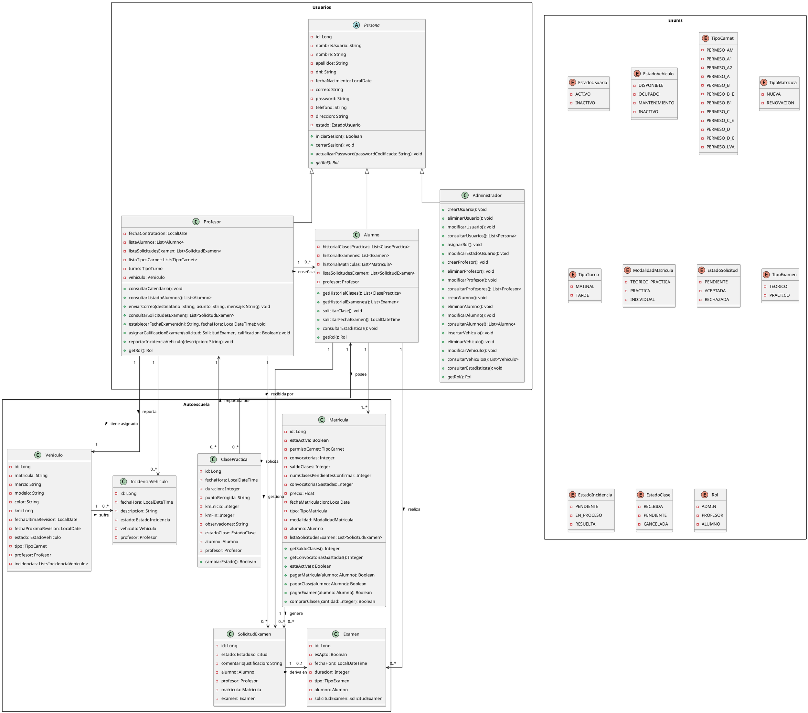

# AGENTS.md - Sistema ERP para Autoescuelas (TFG)
> Guía maestra de arquitectura, directrices de interacción, reglas de dominio y memoria persistente para los agentes de desarrollo

# 1. Reglas Supremas y Comportamiento del Agente
## 1.1. Modo de Interacción y Rol del Agente
- **Idioma Obligatorio:** Español de España (`es-ES`) SIEMPRE en explicaciones, preguntas, respuestas, comentarios y documentación.
- **Rol:** Desarrollador Sénior y Mentor. Antes de entregar código, explica el porqué técnico y de arquitectura en 2-3 frases para facilitar el aprendizaje del desarrollador.
- **Corrección Proactiva:** Si el desarrollador propone una solución con algún error (bugs, fallos de seguridad, problemas de concurrencia, incoherencias con las reglas de negocio...) señálalo inmediatamente y ofrece la alternativa correcta.
- **Formato de Salida (Modo Diff/Quirúrgico):** Prohibido reescribir archivos completos excepto en la creación inicial o si el desarrollador lo indica expresamente. Devuelve únicamente los métodos, fragmentos modificados o diffs unificados indicando la ubicación exacta.
- **Planificación Previa:** Para cualquier tarea de más de 2 pasos, presenta previamente un Plan de Implementación conceptual sin código y espera la confirmación del desarrollador antes de generar nada.
- **Uso de Skills:** Usa siempre las skills disponibles en el proyecto. Si detectas fallos en una skill, corrígela. Tras modificar este archivo, invoca `find-skills` para sincronizar dependencias.

## 1.2. Protocolo de Memoria Viva ("Recuerda...")
- **Trigger:** Cuando el usuario diga *"recuerda"*, *"anota"*, *"actualiza"*, *"apunta esto"*, *"guarda esto en memoria"* o similar, el agente **DEBE editar este archivo `AGENTS.md`** añadiendo la regla o decisión en la sección **11. Memoria Activa y Registro de Decisiones** e indicar la fecha en la que se ha añadido la modificación con el formato (DD/MM/YYYY)
- Este documento es el estado persistente entre chats independientes.

## 1.3. Protocolo de Toma de Decisiones y Dudas
- **Regla:** Ante cualquier duda o ambigüedad sobre la lógica de negocio de las autoescuelas (precios, convocatorias, cancelaciones, estados...) o técnica (contratos de API o diseño de base de datos, librerías...), el agente **NUNCA debe asumir una solución unilateral**.
- **Acción:** Planteará preguntas abiertas de forma clara exponiendo alternativas con sus pros y contras antes de escribir código.

## 1.4. Protocolo de Seguridad en Base de Datos y Despliegue ("Súbelo / Aplícalo")
- **Regla Estricta:** NUNCA ejecutar scripts destructivos (`DROP TABLE`, `TRUNCATE`, modificaciones masivas o irreversibles en Supabase), ni dar por terminado un despliegue a Render sin confirmación explícita del desarrollador.
- **Flujo de Modificación:** Antes de confirmar cambios en esquemas de BD o integraciones críticas (Stripe, FullCalendar), el agente debe presentar un resumen de impacto y esperar el visto bueno del desarrollador.

## 1.5. Protocolo de Uso Sistemático de Skills
- **Regla:** Siempre que exista una skill aplicable (`feature-scaffolder`, `htmx-view-builder`, `stripe-flow-validator`, `business-rules-tester`, `git-commits`), el agente **DEBE utilizarla prioritariamente y ceñirse a sus convenciones**. Si el agente detecta un fallo en una skill, **DEBE corregirla inmediatamente y actualizar el fichero AGENTS.md**

## 1.6. Directrices Estrictas de Diseño UI/UX y Responsive Design (Mobile-First)
- **Responsividad Total:** Todas las vistas, modales y fragmentos generados con Tailwind CSS / UI Kits (Flowbite / DaisyUI) deben ser **100% responsivos** sin desbordamientos horizontales (`overflow-x` no deseado) en móvil (`< 640px`, `sm`), tablet (`768px`, `md`) y escritorio (`>= 1024px`, `lg`/`xl`).
- **Cohesión Visual y Paleta:** Queda prohibido alterar arbitrariamente la paleta de colores, radios de borde (`rounded-*`), tipografías o espaciados entre vistas. Todos los paneles (Admin, Profesor, Alumno, Matricula, CRUDs, etc) deben mantener una estética profesional, limpia y coherente y deben compartir el mismo sistema de diseño y componentes base.
- **Adaptabilidad de Componentes Complejos:**
  - **Tablas y Listados:** En pantallas móviles deben incluir contenedor con `overflow-x-auto` o transformarse en tarjetas (`cards`) apiladas.
  - **Navegación:** Toda barra de navegación debe colapsar en menú hamburguesa o drawer lateral interactivo en pantallas reducidas.
  - **Formularios y Modales:** Deben ajustarse al ancho de pantalla sin recortar botones de acción ni inputs.

---

# 2. Stack Tecnológico y Arquitectura
<table>
  <thead>
    <tr>
      <th>Componente</th>
      <th>Tecnología Seleccionada</th>
      <th>Detalle / Configuración</th>
    </tr>
  </thead>
  <tbody>
    <tr>
      <td><strong>IDE</strong></td>
      <td>Visual Studio Code</td>
      <td>Entorno de desarrollo principal</td>
    </tr>
    <tr>
      <td><strong>Arquitectura</strong></td>
      <td>Monolito Modular MVC</td>
      <td>Estructurado por funcionalidades (<strong>Package by Features</strong>) para maximizar la cohesión y minimizar el acoplamiento</td>
    </tr>
    <tr>
      <td><strong>Backend</strong></td>
      <td>Java 21 + Spring Boot 4.1.x (4.1.1 GA)</td>
      <td>Spring Data JPA, Spring Security, Lombok, MapStruct</td>
    </tr>
    <tr>
      <td><strong>Frontend</strong></td>
      <td>HTML-over-the-wire</td>
      <td>Thymeleaf + HTMX + JS ES6+ (interactividad sin SPA)</td>
    </tr>
    <tr>
      <td><strong>Frontend (UI &amp; Estilos)</strong></td>
      <td>CSS3 + UI Kits Tailwind</td>
      <td>Flowbite / DaisyUI / Preline UI</td>
    </tr>
    <tr>
      <td><strong>Base de Datos</strong></td>
      <td>PostgreSQL (Supabase)</td>
      <td>Base de datos relacional en la nube</td>
    </tr>
    <tr>
      <td><strong>Servidor de Aplicaciones Web</strong></td>
      <td>Apache Tomcat</td>
      <td>Embebido en Spring Boot</td>
    </tr>
    <tr>
      <td><strong>Despliegue</strong></td>
      <td>Render + UptimeRobot</td>
      <td>Plan gratuito Render (750h/mes) combinado con pings HTTP de mantenimiento para evitar la suspensión por inactividad</td>
    </tr>
    <tr>
      <td><strong>Contenedores</strong></td>
      <td>Docker</td>
      <td>Pruebas de correo (Mailpit) y despliegue/entorno local</td>
    </tr>
    <tr>
      <td colspan="3"><strong>Integraciones y APIs Externas</strong></td>
    </tr>
    <tr>
      <td><strong>Pasarela de Pago</strong></td>
      <td>Stripe API</td>
      <td>Webhooks, Checkout Sessions y Payment Intents (o simulación directa para MVC)</td>
    </tr>
    <tr>
      <td><strong>Calendario</strong></td>
      <td>FullCalendar (JS)</td>
      <td>Integración con vistas dinámicas mediante HTMX</td>
    </tr>
    <tr>
      <td><strong>Email</strong></td>
      <td>Spring Mail (JavaMailSender)</td>
      <td>Notificaciones transaccionales automáticas por SMTP</td>
    </tr>
  </tbody>
</table>

---

# 3. Estructura del Proyecto (Package by Features con Subcapas Internas)

```text
src/
├── main/
│   ├── java/com/autoescuela/erp/
│   │   ├── ErpApplication.java
│   │   │
│   │   ├── core/                               <-- Infraestructura transversal compartida
│   │   │   ├── config/                         <-- Configuraciones Spring (@Configuration, Seguridad, etc.)
│   │   │   ├── email/                          <-- Servicio y clientes de correo transaccional (JavaMailSender)
│   │   │   ├── enums/                          <-- Enumerados de dominio (EstadoUsuario, TipoCarnet, Rol, etc.)
│   │   │   ├── excepciones/                    <-- Excepciones de negocio y @ControllerAdvice global
│   │   │   └── security/                       <-- UserDetailsService, evaluadores y filtros de seguridad
│   │   │
│   │   ├── auth/                               <-- Autenticación, registro y recuperación (CU-001, CU-002, CU-022)
│   │   │   ├── controller/                     <-- AutenticacionController (/login, /registro, /recuperar)
│   │   │   ├── dto/                            <-- LoginDTO, RegistroAlumnoDTO, RecuperarPasswordDTO
│   │   │   ├── mapper/                         <-- AutenticacionMapper
│   │   │   ├── model/                          <-- TokenVerificacion
│   │   │   ├── repository/                     <-- TokenVerificacionRepository
│   │   │   └── service/                        <-- AutenticacionService, TokenVerificacionService
│   │   │
│   │   ├── usuarios/                           <-- Gestión de usuarios y perfiles (CU-003 a CU-014, CU-036, CU-037)
│   │   │   ├── controller/                     <-- AdministradorController, ProfesorController, AlumnoController
│   │   │   ├── dto/                            <-- DTOs específicos por perfil (AltaProfesor, AlumnoDetalle, etc.)
│   │   │   ├── mapper/                         <-- AlumnoMapper, ProfesorMapper
│   │   │   ├── model/                          <-- Persona (Abstract), Administrador, Profesor, Alumno
│   │   │   ├── repository/                     <-- PersonaRepository, ProfesorRepository, AlumnoRepository
│   │   │   └── service/                        <-- UsuarioService, ProfesorService, AlumnoService
│   │   │
│   │   ├── flota/                              <-- Vehículos e incidencias mecánicas (CU-015 a CU-018, CU-035)
│   │   │   ├── controller/                     <-- VehiculoController, IncidenciaVehiculoController
│   │   │   ├── dto/                            <-- VehiculoFormularioDTO, VehiculoResumenDTO
│   │   │   ├── mapper/                         <-- VehiculoMapper, IncidenciaVehiculoMapper
│   │   │   ├── model/                          <-- Vehiculo, IncidenciaVehiculo
│   │   │   ├── repository/                     <-- VehiculoRepository, IncidenciaVehiculoRepository
│   │   │   └── service/                        <-- FlotaService
│   │   │
│   │   ├── academico/                          <-- Matrículas y expedientes de alumnos (CU-038, CU-039, CU-048)
│   │   │   ├── controller/                     <-- MatriculaController
│   │   │   ├── dto/                            <-- MatriculaCheckoutDTO, ComprarClasePracticaDTO
│   │   │   ├── mapper/                         <-- MatriculaMapper
│   │   │   ├── model/                          <-- Matricula
│   │   │   ├── repository/                     <-- MatriculaRepository
│   │   │   └── service/                        <-- AcademicoService
│   │   │
│   │   ├── pagos/                              <-- Pasarela de pago Stripe desacoplada (CU-038, CU-039, CU-047)
│   │   │   ├── controller/                     <-- StripeWebhookController
│   │   │   ├── dto/                            <-- SesionPagoDTO
│   │   │   └── service/                        <-- PagoStripeService
│   │   │
│   │   ├── practicas/                          <-- Clases prácticas y Calendario HTMX (CU-023 a CU-027, CU-040 a CU-043)
│   │   │   ├── controller/                     <-- ClasePracticaController, CalendarioController
│   │   │   ├── dto/                            <-- ReservaClasePracticaDTO, EventoCalendarioDTO
│   │   │   ├── mapper/                         <-- ClasePracticaMapper
│   │   │   ├── model/                          <-- ClasePractica
│   │   │   ├── repository/                     <-- ClasePracticaRepository
│   │   │   └── service/                        <-- ClasePracticaService, CalendarioService
│   │   │
│   │   ├── examenes/                           <-- Solicitudes, cupos y notas DGT (CU-028 a CU-032, CU-044, CU-046, CU-047)
│   │   │   ├── controller/                     <-- ExamenController, SolicitudExamenController
│   │   │   ├── dto/                            <-- SolicitudExamenDTO, CalificarExamenDTO
│   │   │   ├── events/                         <-- ExamenAceptadoEvent (desacoplamiento mediante eventos)
│   │   │   ├── mapper/                         <-- ExamenMapper, SolicitudExamenMapper
│   │   │   ├── model/                          <-- SolicitudExamen, Examen
│   │   │   ├── repository/                     <-- SolicitudExamenRepository, ExamenRepository
│   │   │   └── service/                        <-- ExamenService
│   │   │
│   │   └── estadisticas/                       <-- Analítica y métricas (CU-019, CU-021, CU-033, CU-045)
│   │       ├── controller/                     <-- EstadisticaController
│   │       ├── dto/                            <-- EstadisticasAutoescuelaDTO, EstadisticasAlumnoDTO
│   │       ├── mapper/                         <-- EstadisticaMapper
│   │       └── service/                        <-- EstadisticaService
│   │
│   └── resources/                              <-- Recursos, configuración y vistas HTML-over-the-wire
│       ├── static/                             <-- Activos estáticos públicos
│       │   ├── css/                            <-- styles.css (Tailwind compilado / utilidades)
│       │   ├── js/                             <-- htmx-config.js (CSRF automático) y scripts de soporte
│       │   └── imagenes/                       <-- Logotipos, avatares e iconos
│       ├── templates/                          <-- Vistas y componentes Thymeleaf
│       │   ├── layouts/                        <-- layout.html (plantilla base responsiva con navbar y drawer)
│       │   ├── fragments/                      <-- Componentes parciales HTMX (alertas, modales, tablas)
│       │   ├── auth/                           <-- login.html, registro.html, recuperar-password.html
│       │   ├── admin/                          <-- dashboard.html y vistas CRUD de administración
│       │   ├── profesor/                       <-- dashboard.html, agenda y ficha de clase
│       │   ├── alumno/                         <-- dashboard.html, compra de saldo y reservas
│       │   └── error/                          <-- 403.html, 404.html, 500.html, error-negocio.html
│       ├── application.properties              <-- Configuración principal
│       ├── application-supabase.properties     <-- Perfil PostgreSQL en la nube
│       ├── application-h2.properties           <-- Perfil para tests en memoria
│       ├── application-docker.properties       <-- Perfil Docker / Mailpit
│       └── data.sql                            <-- Datos semilla de desarrollo
│
└── test/java/com/autoescuela/erp/              <-- Pruebas automatizadas (espejo de los paquetes de dominio)
    ├── academico/
    ├── auth/
    ├── estadisticas/
    ├── examenes/
    ├── flota/
    ├── practicas/
    ├── usuarios/
    └── ErpApplicationTests.java
```

# 4. Diagrama Modelo Entidad - Relación (Tablas, Relaciones, Enums) en PlantUML


# 5. Diagrama de Casos de Uso (CU) en PlantUML

```plantuml
@startuml Diagrama_CU_v5
left to right direction
skinparam packageStyle rectangle

actor "Persona" as Persona
actor "Administrador" as Admin
actor "Profesor" as Prof
actor "Alumno" as Alum

' Generalización de actores
Persona <|-- Admin
Persona <|-- Prof
Persona <|-- Alum

' --- CASOS DE USO GENERALES ---
usecase "Iniciar sesión" as iniciarSesion << CU-001 >>

' --- CASOS DE USO ADMINISTRADOR ---
usecase "Crear usuario" as crearUsuario << CU-003 >>
usecase "Modificar usuario" as modificarUsuario << CU-004 >>
usecase "Eliminar usuario" as eliminarUsuario << CU-005 >>
usecase "Consultar usuarios" as consultarUsuarios << CU-006 >>

usecase "Crear profesor" as crearProfesor << CU-007 >>
usecase "Modificar profesor" as modificarProfesor << CU-008 >>
usecase "Eliminar profesor" as eliminarProfesor << CU-009 >>
usecase "Consultar profesores" as consultarProfesores << CU-010 >>

usecase "Crear alumno" as crearAlumno << CU-011 >>
usecase "Modificar alumno" as modificarAlumno << CU-012 >>
usecase "Eliminar alumno" as eliminarAlumno << CU-013 >>
usecase "Consultar alumnos" as consultarAlumnos << CU-014 >>

usecase "Insertar vehículo" as insertarVehiculo << CU-015 >>
usecase "Modificar vehículo" as modificarVehiculo << CU-016 >>
usecase "Eliminar vehículo" as eliminarVehiculo << CU-017 >>
usecase "Consultar vehículos" as consultarVehiculos << CU-018 >>

usecase "Consultar estadísticas globales" as cEstadisticasAdmin << CU-019 >>

' --- CASOS DE USO PROFESOR ---
usecase "Establecer credenciales" as establecerCredenciales << CU-022 >>
usecase "Consultar calendario" as consultarCalendarioProf << CU-023 >>
usecase "Modificar clase" as modificarClase << CU-024 >>
usecase "Eliminar clase" as eliminarClase << CU-025 >>
usecase "Rellenar detalles clase" as rellenarDetalles << CU-026 >>
usecase "Notificar alumno por correo" as notificarAlumno << CU-027 >>
usecase "Consultar solicitudes examen" as cSolExamenProf << CU-028 >>
usecase "Aceptar solicitud examen" as aceptarExamen << CU-029 >>
usecase "Rechazar solicitud examen" as rechazarExamen << CU-030 >>
usecase "Bloquear reservas vehículo" as bloquearVehiculo << CU-031 >>
usecase "Calificar examen" as calificarExamen << CU-032 >>
usecase "Consultar estadísticas profesor" as cEstadisticasProf << CU-033 >>
usecase "Reportar incidencia vehículo" as reportarIncidencia << CU-035 >>

' --- CASOS DE USO ALUMNO ---
usecase "Consultar datos personales" as consultarDatos << CU-036 >>
usecase "Modificar datos personales" as modificarDatos << CU-037 >>
usecase "Pagar matriculacion" as pagarMatriculacion << CU-038 >>
note right of pagarMatriculacion : Postcondición: Registro del Alumno\nen la BD en caso de éxito

usecase "Comprar clases" as comprarClases << CU-039 >>
usecase "Consultar calendario" as consultarCalendarioAlum << CU-040 >>
usecase "Reservar clase práctica" as reservarClase << CU-041 >>
usecase "Confirmar clase pendiente" as confirmarClase << CU-042 >>
usecase "Consultar historial clases" as consultarHistorial << CU-043 >>
usecase "Consultar notas examen" as consultarNotas << CU-044 >>
usecase "Consultar estadísticas alumno" as cEstadisticasAlum << CU-045 >>
usecase "Solicitar fecha examen" as solicitarExamen << CU-046 >>
usecase "Pagar tasas examen" as pagarTasas << CU-047 >>
usecase "Solicitar clases iniciación" as solicitarIniciacion << CU-048 >>

' --- RELACIONES ACTOR -> CASO DE USO ---

' Persona y base
Persona -- iniciarSesion

' Administrador
Admin -- crearUsuario
Admin -- modificarUsuario
Admin -- eliminarUsuario
Admin -- consultarUsuarios

Admin -- crearProfesor
Admin -- modificarProfesor
Admin -- eliminarProfesor
Admin -- consultarProfesores

Admin -- crearAlumno
Admin -- modificarAlumno
Admin -- eliminarAlumno
Admin -- consultarAlumnos

Admin -- insertarVehiculo
Admin -- modificarVehiculo
Admin -- eliminarVehiculo
Admin -- consultarVehiculos

Admin -- cEstadisticasAdmin

' Profesor
Prof -- establecerCredenciales
Prof -- consultarCalendarioProf
Prof -- cSolExamenProf
Prof -- calificarExamen
Prof -- cEstadisticasProf
Prof -- reportarIncidencia

' Alumno
Alum -- consultarCalendarioAlum
Alum -- consultarDatos
Alum -- modificarDatos
Alum -- pagarMatriculacion
Alum -- comprarClases
Alum -- confirmarClase
Alum -- consultarHistorial
Alum -- consultarNotas
Alum -- cEstadisticasAlum
Alum -- solicitarExamen
Alum -- solicitarIniciacion

' --- RELACIONES EXTEND E INCLUDE ---

' Extends de Profesor (Consultar Calendario)
consultarCalendarioProf <.. modificarClase : <<extend>>
consultarCalendarioProf <.. eliminarClase : <<extend>>
consultarCalendarioProf <.. rellenarDetalles : <<extend>>

' Extends de Profesor (Gestión Solicitudes)
cSolExamenProf <.. aceptarExamen : <<extend>>
cSolExamenProf <.. rechazarExamen : <<extend>>

' Includes de Profesor (Automatizaciones y Obligaciones)
modificarClase ..> notificarAlumno : <<include>>
eliminarClase ..> notificarAlumno : <<include>>
aceptarExamen ..> notificarAlumno : <<include>>
aceptarExamen ..> bloquearVehiculo : <<include>>

' Includes de Alumno
solicitarExamen ..> pagarTasas : <<include>>

' Extends de Alumno
consultarCalendarioAlum <.. reservarClase : <<extend>>

@enduml
```


# 6. Matriz de Roles y Funcionalidades
## 6.1. Administrador (Acceso Total)
- **Gestión de Flota de Vehículos (CRUD):** Registro de vehículos, control de kilometraje acumulado, estados de ITV y revisiones periódicas.
- **Gestión de Profesores (CRUD):** Altas de profesores (envío de email con token para credenciales), asignación estricta de 1 vehículo y desvinculación de vehículos.
- **Gestión de Alumnos (CRUD):** Supervisión de matrículas, estados, convocatorias y saldos.
- **Bajas y Desvinculaciones**:
- Al eliminar un profesor, se aplica borrado lógico (INACTIVO), se desvincula el vehículo de ese profesor y el vehículo pasa a estado DISPONIBLE.
- Al eliminar un alumno, se aplica borrado lógico (INACTIVO) y se desvincula el alumnno de su respectivo profesor.
- Al eliminar un vehículo, se aplica borrado lógico (INACTIVO) y se desvincula el vehículo de su respectivo profesor.
- **Panel de Estadísticas Globales:** Métricas de tasas de aprobados/suspensos, rendimiento de profesores y estado de la flota.
- **Gestión de Incidencias de Vehículos:** Visualización de incidencias reportadas por los profesores.

## 6.2. Profesor
- **Calendario Exclusivo:** Vista y CRUD únicamente sobre su propio calendario de clases prácticas.
- **Notificación por Cancelación/Edición:** Si se modifica o elimina una clase agendada, el sistema emite automáticamente un correo al alumno afectado.
- **Formulario de Clase en Calendario:** Al pulsar una clase en el calendario, se abre un modal/formulario con:
  - *Datos de solo lectura, inmutables (cargados de la reserva):* Nombre y apellidos del alumno, Fecha de nacimiento, DNI, Día/Fecha/Hora de la clase, Duración y Punto de recogida.
  - *Datos editables por el profesor:* Km del coche al iniciar la clase, Km del coche al finalizar la clase y Campo de Observaciones sobre la evolución del alumno.
- **Gestión de Solicitudes de Examen:** Revisión de solicitudes (PENDIENTE) con posibilidad de RECHAZAR la solicitud indicando obligatoriamente el motivo de rechazo, o ACEPTAR, asignando la fecha del examen a sus alumnos (máximo estricto de **4 alumnos por profesor en un mismo día para el examen práctico**).
- **Calificación del Examen:** Registro de resultado (APTO/ NO APTO) con link a la página oficial de la DGT para consultar el desglose de la nota detallada.
- **Estadísticas Locales:** Tasa personal de aprobados/suspensos y datos del vehículo asignado.

## 6.3. Alumno
- **Matriculación Inicial y Pagos (Stripe):** Matricularse en 1 carnet simultáneo. Pago de matrícula, clases sueltas, bonos de clases y tasas de examen.
- **Reserva de Clases en el Calendario:** Visualización interactiva mediante FullCalendar **únicamente del calendario de su profesor asignado**.
- **Confirmación de Clases Dadas:** En la vista principal se listan las clases impartidas pendientes de validación por parte del alumno. El alumno debe confirmarlas para regularizar su saldo.
- **Histórico de Clases:** Detalle completo de clases realizadas (duración, Km inicial/final y observaciones del profesor).
- **Datos Personales:** Consulta y actualización de su perfil (Nombre, dirección, fecha de nacimiento, ...).
- **Consulta de Notas de Examen:** Visualización del resultado (APTO/ NO APTO) con un link a la web oficial de la DGT para consultar el desglose de la nota detallada.
- **Estadísticas Personales:** Nº de clases recibidas, convocatorias gastadas, horas de conducción, gasto acumulado e información del vehículo de prácticas.
- **Solicitud de Examen:** Petición de fecha para examen teórico o práctico (previo pago de tasas vía Stripe).
- **Clases de Iniciación/Aprendizaje:** Modalidad para alumnos que NO pagan la matrícula completa y abonan únicamente clases prácticas sueltas.

---

# 7. Reglas de Negocio Estrictas
## 7.1. Autenticación, Registro y Estados de Usuario
- **Control de acceso:** Hay 3 roles estrictos: ADMIN, PROFESOR, ALUMNO.
- **Inicio de Sesión:** Profesores y Alumnos pueden iniciar sesión indistintamente con (su `username` o con su `email`) más la contraseña.
- **Alta de Profesores:** Únicamente el Administrador puede dar de alta a un profesor. El profesor recibe un correo con enlace seguro para establecer su nombre de usuario y contraseña iniciales.
- **Alta de Alumnos:** El alumno se registra mediante formulario público y formaliza su alta tras completar el pago de la matrícula en Stripe o registro inicial en el sistema.
- **Trazabilidad de Estados:** La base de datos debe persistir el estado de cada usuario (`ACTIVO`, `INACTIVO`). Se aplica borrado lógico (soft delete) o desactivación de estado para profesores y alumnos, preservando el histórico de clases, exámenes e ingresos.

## 7.2. Matrícula y Convocatorias de Examen
- **Límite de Carnet:** Un alumno solo puede estar matriculado en **1 carnet simultáneamente**.
- **Tipos de Matrícula:**
  1. *Teórico + Prácticas* (opción por defecto)
  2. *Sólo Prácticas*
  3. *Individual* (para prácticas sueltas con personas que ya tienen el carnet)
- **Modalidades de Matrícula:**
  1. *Nueva Matriculación* (alumnos de nuevo ingreso).
  2. *Renovación de Matrícula* (cuando se agotan las convocatorias).
- **Gestión de Convocatorias:** Cada matrícula otorga **2 convocatorias iniciales** de examen. Si el alumno suspende ambas, el sistema bloquea nuevas solicitudes de examen hasta que abone la tasa de Renovación de Matrícula vía Stripe.
- El alumno, en la renovación de matrícula NO puede modificar el tipo de Matrícula, es decir, la renovación será de la Matrícula del tipo en la que está matriculado.

## 7.3. Flota de Vehículos y Profesores
- **Propiedad:** Los vehículos pertenecen a la autoescuela, nunca al profesor.
- **Baja de Profesor:**
  - Al dar de baja a un profesor, se desvinculan sus alumnos asociados y se cancelan automáticamente todas sus clases futuras reservadas.
  - Al dar de baja a un profesor hay 2 opciones:
    - Reasignar a sus alumnos actuales con un nuevo profesor (Se envía un correo a todos sus alumnos para avisarles de la sustitución del profesor y de la cancelación de todas sus clases reservadas actualmente).
    - Dejar a sus alumnos actuales sin profesor (Se envía un correo a cada alumno todos sus alumnos para avisarles de la baja de su profesor y de la cancelación de todas sus clases reservadas actualmente).
  - El vehículo asignado **NO se elimina**; queda libre para ser asignado a otro profesor (DISPONIBLE).
- **Bloqueo por Examen Práctico:** Si se calendariza un examen práctico en un vehículo concreto, el sistema cancela automáticamente todas las clases prácticas previstas para ese día en dicho vehículo, bloquea cualquier intento de reserva en esa fecha y se envía un correo a todos los alumnos que tenían clase ese día explicándoles el motivo de la cancelación de la clase.

## 7.4. Algoritmo y Control de Reserva de Clases
- **Fórmula de Control de Reservas:** $$\text{CapacidadReserva} = \text{saldoClases} - \text{numClasesPendientesPorConfirmar}$$
- **Condición de Compra:** Un alumno solo puede comprar clases sueltas o bonos cuando su saldo de clases restantes sea igual a `0` $\text{(saldoClases=0)}$
  - Comprar una clase individual o un bono incrementa el contador de clases disponibles del alumno mediante pago simulado o checkout de Stripe. ($\text{saldoClases } += \text{ cantidadComprada}$)
- **Condición de Reserva de Clases:**
  - El alumno solo puede reservar una clase si $\text{CapacidadReserva} \gt 0$
- **Condición de Bloqueo de Reserva (Fórmula de Control):**
  - Si $\text{CapacidadReserva} \le 0$ && $\text{numClasesPendientesPorConfirmar} \gt 0$:
    - **NO se muestra el calendario de FullCalendar** en la vista principal del alumno.
    - Se muestra un aviso bloqueante obligándole a confirmar las clases ya recibidas antes de poder reservar una nueva clase.
- **Deducción de Clases:** Al confirmar la clase impartida, se descuenta de forma definitiva del contador de clases restantes del alumno (`saldoClases`).
- **Control de Acceso Concurrente e Integridad de Reservas (Política First-Come, First-Served):**
  - Para garantizar equidad cuando dos o más alumnos intentan reservar simultáneamente el mismo tramo horario con el mismo profesor:
    - **Nivel de Base de Datos:** Se aplica una restricción única compuesta `UNIQUE(profesor_id, fecha_hora)` en la tabla `clase_practica` para aquellos estados activos o reservados.
    - **Nivel de Servicio / JPA:** El método `reservarClase()` debe ejecutarse bajo `@Transactional(isolation = Isolation.READ_COMMITTED)` empleando bloqueo pesimista (`LockModeType.PESSIMISTIC_WRITE`) o verificación atómica previa inserción.
    - **Resolución de Conflicto:** La transacción que complete el *commit* en primer lugar consolida la reserva; cualquier intento concurrente posterior captura la excepción de colisión (`DataIntegrityViolationException` / `OptimisticLockException` / excepción de negocio `HuecoNoDisponibleException`) y devuelve inmediatamente al segundo usuario un fragmento HTMX (HTTP 409 Conflict / 200 con alerta visual) indicando: *"El tramo horario seleccionado acaba de ser ocupado por otro alumno. Por favor, elige otro hueco en el calendario"*.

## 7.5. Circuito de Solicitudes de Examen
- **Tipos de Examen:** Teórico y Práctico. Las opciones deben ocultarse o mostrarse en la UI según el estado académico del alumno (ej. si ya tiene el teórico aprobado, solo puede solicitar el práctico). Estado de solicitud inicial `PENDIENTE`
- **Estados de Solicitud:** `PENDIENTE`, `RECHAZADA`, `ACEPTADA`.
- **Resolución:**
  - Si el profesor **rechaza** la solicitud: debe incluir obligatoriamente un texto de justificación (`CU-030`).
  - Si el profesor **acepta** la solicitud: selecciona la fecha de examen (respetando el cupo de máximo 4 alumnos/día) y el sistema envía un correo al alumno con la citación oficial (`CU-029`).
  - Si el profesor **acepta** la solicitud y ya hay 4 solicitudes aceptadas por ese profesor en ese día, el sistema muestra un mensaje de error, indicándole de que NO es posible aceptar más clases para ese día.
- **Calificación del Examen:** Registro de resultado (APTO/ NO APTO) con link a la página oficial de la DGT para consultar el desglose de la nota detallada.
---

# 8. Reglas de Diseño
- **Consistencia Visual y Responsividad Obligatoria (Mobile-First):**
  - Todas las vistas y fragmentos generados con Tailwind CSS / componentes (Flowbite / DaisyUI) deben ser **100% responsivos** sin desbordamientos horizontales en dispositivos móviles (`sm`), tablets (`md`) y escritorio (`lg`/`xl`).
  - Prohibido alterar arbitrariamente la paleta cromática, tipografías, radios de borde (`rounded-*`) o espaciados entre vistas. La interfaz debe mantener una estética profesional, limpia y coherente en todos los módulos (Admin, Profesor, Alumno).
  - Cada tabla, calendario o formulario complejo debe adaptarse a pantallas pequeñas mediante contenedores con `overflow-x-auto`, layouts en tarjetas (`cards`) apilables o modales adaptativos.

# 8. Catálogo de Skills del Proyecto (`.skills/`)
1. `feature-scaffolder`: Crea la estructura de un paquete (*Package by Feature*) con su Entidad, Repositorio, DTOs, Servicio, Controlador Spring MVC y plantillas Thymeleaf/HTMX.
2. `htmx-view-builder`: Construye fragmentos HTML interactivos y 100% responsivos (móvil, tablet y PC) con Thymeleaf, Tailwind/Flowbite/DaisyUI y atributos HTMX (hx-get, hx-post, hx-target, hx-swap).
3. `stripe-flow-validator`: Implementa y valida la integración de webhooks de Stripe, gestión de firmas criptográficas, intentos de pago y redirecciones seguras de Stripe.
4. `business-rules-tester`: Genera pruebas unitarias e integradas (JUnit 5 + Mockito) enfocadas en las restricciones de negocio estrictas (autenticaciones, límite de convocatorias, cancelaciones, fórmulas de reserva, etc).
5. `git-commits`: Estandariza commits bajo Conventional Commits (feat:, fix:, refactor:, test:, docs:, chore:, style:, build:, perf:).

---

# 9. Plan Maestro de Implementación (2 Meses)

| Fase | Duración | Módulos y Objetivos Clave |
|---|---|---|
| **Fase 1: Base y Seguridad** | Semanas 1-2 | Configuración Supabase/PostgreSQL, Spring Security (login username/email), roles (Admin, Profesor, Alumno) y gestión de perfiles. |
| **Fase 2: Flota, Profesores y Matrículas** | Semanas 3-4 | CRUD de flota (Vehiculo) e incidencias (IncidenciaVehiculo), alta de profesores con invitación por email, matriculaciones (Stripe) y tipos de carnet. |
| **Fase 3: Calendario y Reservas (HTMX)** | Semanas 5-6 | Integración FullCalendar + HTMX, lógica de reserva con bloqueo por confirmación (ClasePractica), formulario de clase del profesor y avisos por correo. |
| **Fase 4: Exámenes, Finanzas y Cierre** | Semanas 7-8 | Flujo de solicitudes de examen (SolicitudExamen, Examen, máx. 4), notas DGT, panel estadísticas, despliegue en Render y ping en UptimeRobot. |

# 10. Restricciones Técnicas y Anti-Patrones
- NO usar Single Page Applications (SPA): Prohibido introducir React, Angular o Vue. Todo el dinamismo se realiza con Thymeleaf + HTMX + JS nativo.
- NO eliminar vehículos, ni usuarios en cascada: Al dar de baja profesores, el vehículo debe conservar su histórico e integridad en la base de datos. Usar borrado lógico (soft delete) o desactivación de estado preservando registros históricos.
- NO exponer IDs secuenciales en URLs críticas: Utilizar UUIDs o identificadores seguros para enlaces de pago, invitaciones y confirmaciones por correo.
- Transaccionalidad en Pagos:
  - Las operaciones de compra y descuento de clases deben ejecutarse de forma transaccional (@Transactional), validando `saldoClases > 0` antes de confirmar cualquier reserva.
  - Las operaciones de Stripe deben procesarse de forma asíncrona mediante Webhooks verificados, nunca asumiendo éxito en la redirección del navegador.
  - Control de Concurrencia en Reservas: Prohibido realizar comprobaciones de disponibilidad en memoria sin sincronización o bloqueo en la base de datos (evitar condiciones de carrera / *race conditions* tipo *Check-Then-Act*). Toda reserva debe asegurarse a nivel transaccional y mediante restricciones de unicidad relacional en PostgreSQL.
- Prohibición de manejadores de eventos inline en HTML (`onclick`, `onsubmit`, `onchange`, etc.): Todo comportamiento JavaScript debe desacoplarse siguiendo el patrón de JavaScript No Intrusivo (*Unobtrusive JS*). Los eventos deben vincularse exclusivamente mediante `addEventListener` en scripts dedicados (o atributos declarativos `hx-*` de HTMX) aprovechando identificadores (`id`) o atributos de datos (`data-*`), garantizando la separación de responsabilidades (SoC) y total conformidad con políticas de seguridad estrictas de cabeceras CSP (*Content Security Policy* sin `unsafe-inline`).
- **Prioridad Absoluta de Legibilidad sobre Concisión (Anti-One-Liners):** Se prohíbe compactar lógica compleja en pocas líneas o abusar de expresiones lambda encadenadas y Streams intrincados de difícil interpretación. Se debe priorizar SIEMPRE un código limpio, autoexplicativo, modular y legible (bucles imperativos claros, estructuras de control explícitas o métodos auxiliares bien nombrados) frente al código comprimido o de alta densidad sintáctica.

# 11. Memoria Activa y Registro de Decisiones
| Fecha (DD/MM/YYYY) | Decisión / Regla Registrada | Contexto / Motivo |
| :--- | :--- | :--- |
| **08/09/2026** | Creación inicial del archivo AGENTS.md | Estandarización de reglas técnicas, diseño UI/UX sénior y protocolos de memoria. |
| **10/09/2026** | Confirmación de Spring Boot 4.1.1 GA e integración de MapStruct 1.6.3 | Verificación de compatibilidad con Java 21 e integración en pom.xml junto a Lombok y lombok-mapstruct-binding. Estructura de DTOs plana por módulo y creación progresiva (Vertical Slice). |
| **11/09/2026** | Consolidación de la arquitectura Package-by-Feature con subcapas internas (`controller`, `dto`, `mapper`, `model`, `repository`, `service`) y estructura frontend Thymeleaf/HTMX | Corrección de erratas en repositorio (`MatriculaRepository`), controlador de incidencias (`IncidenciaVehiculoController`), modularización de DTOs de autenticación con records Java 21, andamiaje de vistas responsivas (`templates/`) y activos (`static/`), sincronizando Sección 3 de AGENTS.md. |
| **12/09/2026** | Población de datos semilla (`data.sql`), soporte de consola H2 en seguridad, sincronización de perfiles (H2, Supabase, Docker) y test de carga `DataSqlH2Test` | Implementación de dataset completo respetando la estrategia de herencia `@Inheritance(strategy = InheritanceType.JOINED)` y restricciones referenciales (4 vehículos, 6 personas con hash BCrypt, 3 alumnos, 2 profesores con permisos, 2 incidencias, 3 matrículas, 4 clases prácticas, 3 solicitudes y 3 exámenes). Habilitación de `frameOptions.sameOrigin()` y exclusión CSRF en `/h2-console/**`. Verificación automatizada con JUnit 5 + `JdbcTemplate`. |
| **13/09/2026** | Desacoplamiento de pasarela de pago (Stripe) al paquete independiente `pagos` (`com.autoescuela.erp.pagos`) | Extracción de `PagoStripeService` y `StripeWebhookController` fuera de `academico`. Justificación arquitectónica: evitar acoplamiento cruzado y duplicidad al requerir cobros para matrículas/bonos (`academico`) y tasas de examen oficial DGT (`examenes`, CU-046/CU-047). Centralización del endpoint webhook global de Stripe y soporte agnóstico de sesiones de Checkout mediante metadatos y eventos. |
| **13/09/2026** | Configuración integral de Spring Security con JSESSIONID y soporte HTMX | Adopción de sesiones basadas en cookies seguras (`JSESSIONID`) con `HttpOnly` y `SameSite=Lax`. Implementación de login dual (nombre de usuario o correo según Regla 7.1), `UsuarioDetalles`, redirección post-login dinámica por rol (`RedireccionPorRolSuccessHandler`), manejo transparente de expiración de sesión en HTMX (`HX-Redirect`), exclusión segura de CSRF para consola H2 y webhooks de Stripe, y control de concurrencia limitando estrictamente a 1 sesión activa por usuario con `HttpSessionEventPublisher`. Verificación con 11 tests de integración en `SeguridadIntegrationTest`. |
| **14/09/2026** | Frontend de autenticación *split-screen* (Login/Registro) con Tailwind CSS, Flowbite y conmutación instantánea reactiva | Maquetación responsiva en 2 columnas: panel izquierdo con identidad de marca, logotipo vectorial ManDS, propuesta de valor y slot desacoplado para imagen de flota; panel derecho con selector de pestañas accesible para alternar instantáneamente mediante JS nativo entre inicio de sesión y registro de alumnos, integración con endpoints Spring Security (`/login`, `/registro`), soporte dual username/correo, visibilidad dinámica de contraseñas y alertas contextuales (`error`, `logout`, `expirada`). Verificación con `LoginViewTest` (4 tests) y `SeguridadIntegrationTest` (11 tests). |
| **15/09/2026** | Diseño e implementación de las vistas completas de Login y Registro de Alumnos | Implementación integral del frontend de autenticación: maquetación de `login.html` y `registro.html` con Tailwind CSS y componentes Flowbite, desacoplamiento de interactividad cliente en `login.js` y `registro.js` (validaciones en tiempo real, alternancia de visibilidad de contraseñas), soporte transversal de tokens CSRF para HTMX mediante `htmx-config.js` y suites de pruebas automatizadas con MockMvc (`VistaLoginTest` y `VistaRegistroTest`). |
| **15/09/2026** | Alineación de roles en Spring Security con prefijo `ROLE_` y habilitación del Dashboard de Alumno | Corrección de autorización en Spring Security: adopción de autoridades con prefijo canónico `ROLE_` (`ROLE_` + `persona.getRol().name()`) en `UserDetailsImpl` para satisfacer los matchers `.hasRole(...)` de `ConfiguracionSeguridad`. Sincronización en `RedireccionPorRolSuccessHandler` evaluando `"ROLE_ADMIN"`, `"ROLE_PROFESOR"` y `"ROLE_ALUMNO"`. Implementación del controlador `AlumnoController.redirectToDashboard` inyectando `@AuthenticationPrincipal UserDetailsImpl` para propagar el `nombreAlumno` al modelo y renderizarlo dinámicamente en `alumno/dashboard.html`. |
| **15/09/2026** | Diseño e implementación integral de la Vista de Recuperación y Restablecimiento de Contraseña (`CU-022`) | Creación de la vista `auth/recuperar-password.html` con diseño *split-screen* responsivo y gestión multiestado en una sola plantilla (solicitud por email, restablecimiento con token criptográfico temporal y confirmación de éxito). Integración en `AutenticacionController` (`GET /recuperar-password`), lógica cliente en `recuperar-password.js` bajo JavaScript no intrusivo (`addEventListener`, validación en tiempo real de requisitos de complejidad de clave y coincidencia, alternancia accesible de visibilidad) y suite de pruebas automatizadas `VistaRecuperarPasswordTest` (5 tests MockMvc verificando estados, alertas contextuales y branding). |
| **16/09/2026** | Consolidación del Backend para el Formulario de Login (`CU-001`) y Cierre de Sesión Automático en `/login` | Definición de `LoginDTO` como record inmutable de Java 21 con validaciones Bean Validation (`@NotBlank`). Implementación de `AutenticacionService` con métodos de consulta del estado de autenticación (`estaAutenticado`), recuperación segura de `UserDetailsImpl` y `Persona`, e invalidación controlada de sesión (`cerrarSesion`). Optimización de `AutenticacionController` para cerrar sesión automáticamente e invalidar cookies cuando un usuario autenticado navega a `/login`, previniendo sesiones inconsistentes. Verificación con suite unitaria `AutenticacionServiceTest` (5 tests) y ampliación de `VistaLoginTest` (total 36 tests superados). |