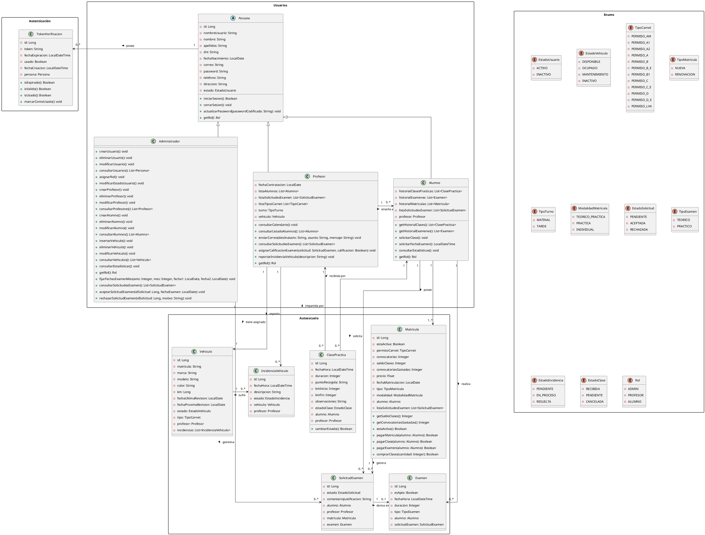

# AGENTS.md - Sistema ERP para Autoescuelas (TFG)
> Guía maestra de arquitectura, directrices de interacción, reglas de dominio y memoria persistente para los agentes de desarrollo

# 1. Reglas Supremas y Comportamiento del Agente
## 1.1. Modo de Interacción y Rol del Agente
- **Idioma Obligatorio:** Español de España (`es-ES`) SIEMPRE en explicaciones, preguntas, respuestas, comentarios y documentación.
- **Rol:** Desarrollador Sénior y Mentor. Antes de entregar código, explica el porqué técnico y de arquitectura en 2-3 frases para facilitar el aprendizaje del desarrollador.
- **Corrección Proactiva:** Si el desarrollador propone una solución con algún error (bugs, fallos de seguridad, problemas de concurrencia, incoherencias con las reglas de negocio...) señálalo inmediatamente y ofrece la alternativa correcta.
- **Formato de Salida (Modo Diff/Quirúrgico):** Prohibido reescribir archivos completos excepto en la creación inicial o si el desarrollador lo indica expresamente. Devuelve únicamente los métodos, fragmentos modificados o diffs unificados indicando la ubicación exacta.
- **Planificación Previa y Walkthroughs en Artefactos:** Para cualquier tarea de más de 2 pasos, presenta previamente un Plan de Implementación conceptual sin código y espera la confirmación del desarrollador antes de generar nada. Tanto los planes de implementación como los walkthroughs o informes técnicos detallados deben entregarse obligatoriamente como documentos/ficheros de artefacto Markdown en el panel lateral para permitir una lectura limpia, estructurada y sin saturar el flujo del chat.
- **Uso de Skills:** Usa siempre las skills disponibles en el proyecto. Si detectas fallos en una skill, corrígela. Tras modificar este archivo, invoca `find-skills` para sincronizar dependencias.
- **El Código Productivo del Desarrollador es la Fuente de Verdad (Adaptar Tests, NO Revertir Código):**
  - Cuando el desarrollador introduce o modifica código de negocio, arquitectura o contratos de métodos, **dichos cambios representan la nueva intención y diseño oficial del sistema**.
  - Queda **TERMINANTEMENTE PROHIBIDO** que el agente revierta, modifique, elimine o altere la lógica introducida por el desarrollador con la excusa de que "un test ha fallado" o para "hacer que la suite vuelva a estar en verde".
  - Si un test falla tras una modificación realizada por el desarrollador, el agente debe asumir que el test ha quedado desactualizado u obsoleto: su labor consiste en **refactorizar, adaptar y actualizar las aserciones, mocks, datos de entrada y expectativas del Test** para que tengan sentido y validen rigurosamente el nuevo código.

## 1.2. Protocolo de Memoria Viva ("Recuerda...")
- **Trigger:** Cuando el usuario diga *"recuerda"*, *"anota"*, *"actualiza"*, *"apunta esto"*, *"guarda esto en memoria"* o similar, el agente **DEBE editar este archivo `AGENTS.md`** añadiendo la regla o decisión en la sección **11. Memoria Activa y Registro de Decisiones** e indicar la fecha en la que se ha añadido la modificación con el formato (DD/MM/YYYY)
- Este documento es el estado persistente entre chats independientes.

## 1.3. Protocolo de Toma de Decisiones y Dudas
- **Regla:** Ante cualquier duda o ambigüedad sobre la lógica de negocio de las autoescuelas (precios, convocatorias, cancelaciones, estados...) o técnica (contratos de API o diseño de base de datos, librerías...), el agente **NUNCA debe asumir una solución unilateral**.
- **Acción:** Planteará preguntas abiertas de forma clara exponiendo alternativas con sus pros y contras antes de escribir código.

## 1.4. Protocolo de Seguridad en Base de Datos y Despliegue ("Súbelo / Aplícalo")
- **Regla Estricta:** NUNCA ejecutar scripts destructivos (`DROP TABLE`, `TRUNCATE`, modificaciones masivas o irreversibles en Supabase), ni dar por terminado un despliegue a Render sin confirmación explícita del desarrollador.
- **Flujo de Modificación:** Antes de confirmar cambios en esquemas de BD o integraciones críticas (Stripe, FullCalendar), el agente debe presentar un resumen de impacto y esperar el visto bueno del desarrollador.

## 1.5. Protocolo de Uso Sistemático de Skills
- **Regla:** Siempre que exista una skill aplicable (`feature-scaffolder`, `htmx-view-builder`, `stripe-flow-validator`, `business-rules-tester`, `git-commits`), el agente **DEBE utilizarla prioritariamente y ceñirse a sus convenciones**. Si el agente detecta un fallo en una skill, **DEBE corregirla inmediatamente y actualizar el fichero AGENTS.md**

## 1.6. Directrices Estrictas de Diseño UI/UX y Responsive Design (Mobile-First)
- **Responsividad Total:** Todas las vistas, modales y fragmentos generados con Tailwind CSS / UI Kits (Flowbite / DaisyUI) deben ser **100% responsivos** sin desbordamientos horizontales (`overflow-x` no deseado) en móvil (`< 640px`, `sm`), tablet (`768px`, `md`) y escritorio (`>= 1024px`, `lg`/`xl`).
- **Cohesión Visual y Paleta:** Queda prohibido alterar arbitrariamente la paleta de colores, radios de borde (`rounded-*`), tipografías o espaciados entre vistas. Todos los paneles (Admin, Profesor, Alumno, Matricula, CRUDs, etc) deben mantener una estética profesional, limpia y coherente y deben compartir el mismo sistema de diseño y componentes base.
- **Adaptabilidad de Componentes Complejos:**
  - **Tablas y Listados:** En pantallas móviles deben incluir contenedor con `overflow-x-auto` o transformarse en tarjetas (`cards`) apiladas.
  - **Navegación:** Toda barra de navegación debe colapsar en menú hamburguesa o drawer lateral interactivo en pantallas reducidas.
  - **Formularios y Modales:** Deben ajustarse al ancho de pantalla sin recortar botones de acción ni inputs.

---

# 2. Stack Tecnológico y Arquitectura
<table>
  <thead>
    <tr>
      <th>Componente</th>
      <th>Tecnología Seleccionada</th>
      <th>Detalle / Configuración</th>
    </tr>
  </thead>
  <tbody>
    <tr>
      <td><strong>IDE</strong></td>
      <td>Visual Studio Code</td>
      <td>Entorno de desarrollo principal</td>
    </tr>
    <tr>
      <td><strong>Arquitectura</strong></td>
      <td>Monolito Modular MVC</td>
      <td>Estructurado por funcionalidades (<strong>Package by Features</strong>) para maximizar la cohesión y minimizar el acoplamiento</td>
    </tr>
    <tr>
      <td><strong>Backend</strong></td>
      <td>Java 21 + Spring Boot 4.1.x (4.1.1 GA)</td>
      <td>Spring Data JPA, Spring Security, Lombok, MapStruct</td>
    </tr>
    <tr>
      <td><strong>Frontend</strong></td>
      <td>HTML-over-the-wire</td>
      <td>Thymeleaf + HTMX + JS ES6+ (interactividad sin SPA)</td>
    </tr>
    <tr>
      <td><strong>Frontend (UI &amp; Estilos)</strong></td>
      <td>CSS3 + UI Kits Tailwind</td>
      <td>Flowbite / DaisyUI / Preline UI</td>
    </tr>
    <tr>
      <td><strong>Base de Datos</strong></td>
      <td>PostgreSQL (Supabase)</td>
      <td>Base de datos relacional en la nube</td>
    </tr>
    <tr>
      <td><strong>Servidor de Aplicaciones Web</strong></td>
      <td>Apache Tomcat</td>
      <td>Embebido en Spring Boot</td>
    </tr>
    <tr>
      <td><strong>Despliegue</strong></td>
      <td>Render + UptimeRobot</td>
      <td>Plan gratuito Render (750h/mes) combinado con pings HTTP de mantenimiento para evitar la suspensión por inactividad</td>
    </tr>
    <tr>
      <td><strong>Contenedores</strong></td>
      <td>Docker</td>
      <td>Pruebas de correo (Mailpit) y despliegue/entorno local</td>
    </tr>
    <tr>
      <td colspan="3"><strong>Integraciones y APIs Externas</strong></td>
    </tr>
    <tr>
      <td><strong>Pasarela de Pago</strong></td>
      <td>Stripe API</td>
      <td>Webhooks, Checkout Sessions y Payment Intents (o simulación directa para MVC)</td>
    </tr>
    <tr>
      <td><strong>Calendario</strong></td>
      <td>FullCalendar (JS)</td>
      <td>Integración con vistas dinámicas mediante HTMX</td>
    </tr>
    <tr>
      <td><strong>Email</strong></td>
      <td>Spring Mail (JavaMailSender)</td>
      <td>Notificaciones transaccionales automáticas por SMTP</td>
    </tr>
  </tbody>
</table>

---

# 3. Estructura del Proyecto (Package by Features con Subcapas Internas)

```text
src/
├── main/
│   ├── java/com/autoescuela/erp/
│   │   ├── ErpApplication.java
│   │   │
│   │   ├── core/                               <-- Infraestructura transversal compartida
│   │   │   ├── config/                         <-- Configuraciones Spring (@Configuration, Seguridad, Mail, etc.)
│   │   │   ├── email/                          <-- EmailService, EmailServiceImpl (JavaMailSender)
│   │   │   ├── enums/                          <-- Enumerados de dominio (EstadoUsuario, TipoCarnet, Rol, etc.)
│   │   │   ├── excepciones/                    <-- GlobalExceptionHandler, ReglaNegocioException, RecursoNoEncontradoException
│   │   │   └── security/                       <-- UserDetailsServiceImpl, UserDetailsImpl, RedireccionPorRolSuccessHandler, HtmxAuthenticationEntryPoint
│   │   │
│   │   ├── auth/                               <-- Autenticación, registro y recuperación
│   │   │   ├── controller/                     <-- AuthenticationController (/login, /registro, /recuperar)
│   │   │   ├── dto/                            <-- LoginDTO, RegistroAlumnoDTO, RecuperarPasswordDTO, RestablecerPasswordDTO
│   │   │   ├── mapper/                         <-- AuthenticationMapper
│   │   │   ├── model/                          <-- TokenVerificacion
│   │   │   ├── repository/                     <-- TokenVerificacionRepository
│   │   │   └── service/                        <-- AuthenticationService, TokenVerificacionService
│   │   │
│   │   ├── usuarios/                           <-- Gestión de usuarios y perfiles
│   │   │   ├── controller/                     <-- AdministradorController, PerfilController, ProfesorController, AlumnoController, UsuarioController
│   │   │   ├── dto/                            <-- AltaProfesorDTO, AlumnoDetalleDTO, EditarPerfilAlumnoDTO, EditarPerfilAdminDTO, EditarProfesorDTO, ReasignarAlumnoDTO, CambiarPasswordDTO, etc.
│   │   │   ├── mapper/                         <-- AlumnoMapper, ProfesorMapper, UsuarioMapper
│   │   │   ├── model/                          <-- Persona (Abstract), Administrador, Profesor, Alumno
│   │   │   ├── repository/                     <-- PersonaRepository, ProfesorRepository, AlumnoRepository
│   │   │   └── service/                        <-- UsuarioService, ProfesorService, AlumnoService
│   │   │
│   │   ├── flota/                              <-- Vehículos e incidencias mecánicas
│   │   │   ├── controller/                     <-- VehiculoController, IncidenciaVehiculoController
│   │   │   ├── dto/                            <-- VehiculoFormularioDTO, VehiculoResumenDTO
│   │   │   ├── mapper/                         <-- VehiculoMapper, IncidenciaVehiculoMapper
│   │   │   ├── model/                          <-- Vehiculo, IncidenciaVehiculo
│   │   │   ├── repository/                     <-- VehiculoRepository, IncidenciaVehiculoRepository
│   │   │   └── service/                        <-- FlotaService
│   │   │
│   │   ├── academico/                          <-- Matrículas y expedientes de alumnos
│   │   │   ├── controller/                     <-- MatriculaController
│   │   │   ├── dto/                            <-- MatriculaCheckoutDTO, ComprarClasePracticaDTO
│   │   │   ├── mapper/                         <-- MatriculaMapper
│   │   │   ├── model/                          <-- Matricula
│   │   │   ├── repository/                     <-- MatriculaRepository
│   │   │   └── service/                        <-- AcademicoService
│   │   │
│   │   ├── pagos/                              <-- Pasarela de pago Stripe desacoplada
│   │   │   ├── controller/                     <-- StripeWebhookController
│   │   │   ├── dto/                            <-- SesionPagoDTO
│   │   │   └── service/                        <-- PagoStripeService
│   │   │
│   │   ├── practicas/                          <-- Clases prácticas y Calendario HTMX
│   │   │   ├── controller/                     <-- ClasePracticaController, CalendarioController
│   │   │   ├── dto/                            <-- ReservaClasePracticaDTO, EventoCalendarioDTO
│   │   │   ├── mapper/                         <-- ClasePracticaMapper
│   │   │   ├── model/                          <-- ClasePractica
│   │   │   ├── repository/                     <-- ClasePracticaRepository
│   │   │   └── service/                        <-- ClasePracticaService, CalendarioService
│   │   │
│   │   ├── examenes/                           <-- Solicitudes, cupos y notas DGT
│   │   │   ├── controller/                     <-- ExamenController, SolicitudExamenController
│   │   │   ├── dto/                            <-- SolicitudExamenDTO, CalificarExamenDTO
│   │   │   ├── events/                         <-- ExamenAceptadoEvent (desacoplamiento mediante eventos)
│   │   │   ├── mapper/                         <-- ExamenMapper, SolicitudExamenMapper
│   │   │   ├── model/                          <-- SolicitudExamen, Examen
│   │   │   ├── repository/                     <-- SolicitudExamenRepository, ExamenRepository
│   │   │   └── service/                        <-- ExamenService
│   │   │
│   │   └── estadisticas/                       <-- Analítica y métricas
│   │       ├── controller/                     <-- EstadisticaController
│   │       ├── dto/                            <-- EstadisticasAutoescuelaDTO, EstadisticasAlumnoDTO
│   │       ├── mapper/                         <-- EstadisticaMapper
│   │       └── service/                        <-- EstadisticaService
│   │
│   └── resources/                              <-- Recursos, configuración y vistas HTML-over-the-wire
│       ├── static/                             <-- Activos estáticos públicos
│       │   ├── css/                            <-- styles.css (Tailwind compilado / utilidades)
│       │   ├── js/                             <-- htmx-config.js, login.js, registro.js, recuperar-password.js, layout.js, admin.js
│       │   └── imagenes/                       <-- Logotipos, avatares e iconos
│       ├── templates/                          <-- Vistas y componentes Thymeleaf
│       │   ├── layouts/                        <-- layout.html (plantilla base responsiva con navbar y drawer)
│       │   ├── fragments/                      <-- Componentes parciales HTMX (alertas, modales, tablas) y navegación (admin-nav.html)
│       │   ├── auth/                           <-- login.html, registro.html, recuperar-password.html
│       │   ├── admin/                          <-- dashboard.html, perfil.html y vistas maestras de administración (alumnos, profesores, flota, incidencias, practicas, examenes, estadisticas)
│       │   ├── profesor/                       <-- dashboard.html, agenda y ficha de clase
│       │   ├── alumno/                         <-- dashboard.html, compra de saldo y reservas
│       │   └── error/                          <-- 403.html, 404.html, 500.html, error-negocio.html
│       ├── application.properties              <-- Configuración principal
│       ├── application-supabase.properties     <-- Perfil PostgreSQL en la nube
│       ├── application-h2.properties           <-- Perfil para tests en memoria
│       ├── application-docker.properties       <-- Perfil Docker / Mailpit
│       └── data.sql                            <-- Datos semilla de desarrollo
│
└── test/java/com/autoescuela/erp/              <-- Pruebas automatizadas (espejo de los paquetes de dominio)
    ├── academico/
    ├── auth/                                   <-- Tests unitarios y de integración de auth y tokens
    ├── core/                                   <-- Tests de seguridad transversal (SeguridadIntegrationTest)
    ├── estadisticas/
    ├── examenes/
    ├── flota/
    ├── practicas/
    ├── usuarios/
    ├── DataSqlH2Test.java                      <-- Verificación de consistencia del dataset semilla
    └── ErpApplicationTests.java
```

# 4. Diagrama Modelo Entidad - Relación (Tablas, Relaciones, Enums) en PlantUML


# 5. Diagrama de Casos de Uso (CU) en PlantUML

```plantuml
@startuml Diagrama_CU_v7
left to right direction
skinparam packageStyle rectangle

actor "Persona" as Persona
actor "Administrador" as Admin
actor "Profesor" as Prof
actor "Alumno" as Alum

' Generalización de actores
Persona <|-- Admin
Persona <|-- Prof
Persona <|-- Alum

' --- CASOS DE USO GENERALES ---
usecase "Iniciar sesión" as iniciarSesion << CU-001 >>

' --- CASOS DE USO ADMINISTRADOR ---

usecase "Crear profesor" as crearProfesor << CU-002 >>
usecase "Modificar profesor" as modificarProfesor << CU-003 >>
usecase "Eliminar profesor" as eliminarProfesor << CU-004 >>
usecase "Consultar profesores" as consultarProfesores << CU-005 >>

usecase "Crear alumno" as crearAlumno << CU-006 >>
usecase "Modificar alumno" as modificarAlumno << CU-007 >>
usecase "Eliminar alumno" as eliminarAlumno << CU-008 >>
usecase "Consultar alumnos" as consultarAlumnos << CU-009 >>

usecase "Insertar vehículo" as insertarVehiculo << CU-010 >>
usecase "Modificar vehículo" as modificarVehiculo << CU-011 >>
usecase "Eliminar vehículo" as eliminarVehiculo << CU-012 >>
usecase "Consultar vehículos" as consultarVehiculos << CU-013 >>

usecase "Consultar estadísticas globales" as cEstadisticasAdmin << CU-014 >>

usecase "Consultar solicitudes examen" as consultarSolicitudExamen << CU-015 >>
usecase "Aceptar solicitud examen" as aceptarSolicitudExamen << CU-016 >>
usecase "Bloquear reservas vehículo" as bloquearReservasVehiculo << CU-017 >>
usecase "Notificar alumno por correo" as notificarAlumno << CU-018 >>
usecase "Rechazar solicitud examen" as rechazarSolicitudExamen << CU-019 >>

' --- CASOS DE USO PROFESOR ---
usecase "Establecer credenciales" as establecerCredenciales << CU-020 >>
usecase "Consultar calendario" as consultarCalendarioProf << CU-021 >>
usecase "Modificar clase" as modificarClase << CU-022 >>
usecase "Eliminar clase" as eliminarClase << CU-023 >>
usecase "Rellenar detalles clase" as rellenarDetalles << CU-024 >>
usecase "Calificar examen" as calificarExamen << CU-025 >>
usecase "Consultar estadísticas profesor" as cEstadisticasProf << CU-026 >>
usecase "Reportar incidencia vehículo" as reportarIncidencia << CU-027 >>

' --- CASOS DE USO ALUMNO ---
usecase "Recuperar contraseña" as recuperarPassword << CU-028 >>
usecase "Consultar datos personales" as consultarDatos << CU-029 >>
usecase "Modificar datos personales" as modificarDatos << CU-030 >>
usecase "Pagar matriculacion / Registrarse" as pagarMatriculacion << CU-031 >>
note right of pagarMatriculacion : Postcondición: Registro del Alumno\nen la BD en caso de éxito

usecase "Comprar clases" as comprarClases << CU-032 >>
usecase "Consultar calendario" as consultarCalendarioAlum << CU-033 >>
usecase "Reservar clase práctica" as reservarClase << CU-034 >>
usecase "Consultar historial clases" as consultarHistorial << CU-035 >>
usecase "Consultar notas examen" as consultarNotas << CU-036 >>
usecase "Consultar estadísticas alumno" as cEstadisticasAlum << CU-037 >>
usecase "Solicitar fecha examen" as solicitarExamen << CU-038 >>
usecase "Pagar tasas examen" as pagarTasas << CU-039 >>
usecase "Solicitar clases iniciación" as solicitarIniciacion << CU-040 >>

' --- RELACIONES ACTOR -> CASO DE USO ---

' Persona y base
Persona -- iniciarSesion

' Administrador
Admin -- crearProfesor
Admin -- modificarProfesor
Admin -- eliminarProfesor
Admin -- consultarProfesores

Admin -- crearAlumno
Admin -- modificarAlumno
Admin -- eliminarAlumno
Admin -- consultarAlumnos

Admin -- insertarVehiculo
Admin -- modificarVehiculo
Admin -- eliminarVehiculo
Admin -- consultarVehiculos

Admin -- cEstadisticasAdmin
Admin -- consultarSolicitudExamen

' Profesor
Prof -- establecerCredenciales
Prof -- consultarCalendarioProf
Prof -- calificarExamen
Prof -- cEstadisticasProf
Prof -- reportarIncidencia

' Alumno
Alum -- recuperarPassword
Alum -- consultarCalendarioAlum
Alum -- consultarDatos
Alum -- modificarDatos
Alum -- pagarMatriculacion
Alum -- comprarClases
Alum -- consultarHistorial
Alum -- consultarNotas
Alum -- cEstadisticasAlum
Alum -- solicitarExamen
Alum -- solicitarIniciacion

' --- RELACIONES EXTEND E INCLUDE ---

' Extends de Administrador (Gestión Solicitudes)
consultarSolicitudExamen <.. aceptarSolicitudExamen : <<extend>>
aceptarSolicitudExamen ..> notificarAlumno : <<include>>
aceptarSolicitudExamen ..> bloquearReservasVehiculo : <<include>>
consultarSolicitudExamen <.. rechazarSolicitudExamen : <<extend>>
rechazarSolicitudExamen ..> notificarAlumno : <<include>>

' Extends de Profesor (Consultar Calendario)
consultarCalendarioProf <.. modificarClase : <<extend>>
consultarCalendarioProf <.. eliminarClase : <<extend>>
consultarCalendarioProf <.. rellenarDetalles : <<extend>>

' Includes de Profesor (Automatizaciones y Obligaciones)
modificarClase ..> notificarAlumno : <<include>>
eliminarClase ..> notificarAlumno : <<include>>

' Includes de Alumno
solicitarExamen ..> pagarTasas : <<include>>

' Extends de Alumno
consultarCalendarioAlum <.. reservarClase : <<extend>>

@enduml
```


# 6. Matriz de Roles y Funcionalidades
## 6.1. Administrador (Acceso Total)
- **Gestión de Flota de Vehículos (CRUD):** Registro de vehículos, control de kilometraje acumulado, estados de ITV y revisiones periódicas.
- **Gestión de Profesores (CRUD):** Altas de profesores (envío de email con token para credenciales), asignación estricta de 1 vehículo y desvinculación de vehículos.
- **Gestión de Alumnos (CRUD):** Supervisión de matrículas, estados, convocatorias y saldos.
- **Bajas y Desvinculaciones**:
- Al eliminar un profesor, se aplica borrado lógico (INACTIVO), se desvincula el vehículo de ese profesor y el vehículo pasa a estado DISPONIBLE.
- Al eliminar un alumno, se aplica borrado lógico (INACTIVO) y se desvincula el alumnno de su respectivo profesor.
- Al eliminar un vehículo, se aplica borrado lógico (INACTIVO) y se desvincula el vehículo de su respectivo profesor.
- **Panel de Estadísticas Globales:** Métricas de tasas de aprobados/suspensos, rendimiento de profesores y estado de la flota.
- **Gestión de Incidencias de Vehículos:** Visualización de incidencias reportadas por los profesores.
- **Gestión Centralizada de Solicitudes y Convocatorias de Examen (DGT):** Panel exclusivo para parametrizar y fijar manualmente las 2 fechas mensuales oficiales de examen DGT, consultar el listado de solicitudes pendientes ordenadas por antigüedad (FIFO), y aceptar (asignando una de las 2 fechas y respetando el cupo de máx. 4 alumnos por profesor y carnet) o rechazar solicitudes (con justificación obligatoria).

## 6.2. Profesor
- **Calendario Exclusivo:** Vista y CRUD únicamente sobre su propio calendario de clases prácticas.
- **Notificación por Cancelación/Edición:** Si se modifica o elimina una clase agendada, el sistema emite automáticamente un correo al alumno afectado.
- **Formulario de Clase en Calendario:** Al pulsar una clase en el calendario, se abre un modal/formulario con:
  - *Datos de solo lectura, inmutables (cargados de la reserva):* Nombre y apellidos del alumno, Fecha de nacimiento, DNI, Día/Fecha/Hora de la clase, Duración y Punto de recogida.
  - *Datos editables por el profesor:* Km del coche al iniciar la clase, Km del coche al finalizar la clase y Campo de Observaciones sobre la evolución del alumno.
- **Gestión de Solicitudes de Examen:** Revisión de solicitudes (PENDIENTE) con posibilidad de RECHAZAR la solicitud indicando obligatoriamente el motivo de rechazo, o ACEPTAR, asignando la fecha del examen a sus alumnos (máximo estricto de **4 alumnos por profesor en un mismo día para el examen práctico**).
- **Calificación del Examen:** Registro de resultado (APTO/ NO APTO) con link a la página oficial de la DGT para consultar el desglose de la nota detallada.
- **Estadísticas Locales:** Tasa personal de aprobados/suspensos y datos del vehículo asignado.
- **Consulta de Solicitudes y Convocatorias:** El profesor únicamente puede consultar el estado de las solicitudes y la lista de alumnos asignados a examen en su vehículo/turno. No tiene privilegios para aceptar, rechazar ni fijar fechas de examen.

## 6.3. Alumno
- **Matriculación Inicial y Pagos (Stripe):** Matricularse en 1 carnet simultáneo. Pago de matrícula, clases sueltas, bonos de clases y tasas de examen.
- **Reserva de Clases en el Calendario:** Visualización interactiva mediante FullCalendar **únicamente del calendario de su profesor asignado**.
- **Histórico de Clases:** Detalle completo de clases realizadas y consolidadas (duración, Km inicial/final y observaciones del profesor registradas tras la clase).
- **Datos Personales:** Consulta y actualización de su perfil (Nombre, dirección, fecha de nacimiento, ...).
- **Consulta de Notas de Examen:** Visualización del resultado (APTO/ NO APTO) con un link a la web oficial de la DGT para consultar el desglose de la nota detallada.
- **Estadísticas Personales:** Nº de clases recibidas, convocatorias gastadas, horas de conducción, gasto acumulado e información del vehículo de prácticas.
- **Solicitud de Examen:** Petición de fecha para examen teórico o práctico (previo pago de tasas vía Stripe).
- **Clases de Iniciación/Aprendizaje:** Modalidad para alumnos que NO pagan la matrícula completa y abonan únicamente clases prácticas sueltas.

---

# 7. Reglas de Negocio Estrictas
## 7.1. Autenticación, Registro y Estados de Usuario
- **Control de acceso:** Hay 3 roles estrictos: ADMIN, PROFESOR, ALUMNO.
- **Inicio de Sesión:** Profesores y Alumnos pueden iniciar sesión indistintamente con (su `username` o con su `email`) más la contraseña.
- **Alta de Profesores:** Únicamente el Administrador puede dar de alta a un profesor. El profesor recibe un correo con enlace seguro para establecer su nombre de usuario y contraseña iniciales.
- **Alta de Alumnos:** El alumno se registra mediante formulario público y formaliza su alta tras completar el pago de la matrícula en Stripe o registro inicial en el sistema.
- **Trazabilidad de Estados:** La base de datos debe persistir el estado de cada usuario (`ACTIVO`, `INACTIVO`). Se aplica borrado lógico (soft delete) o desactivación de estado para profesores y alumnos, preservando el histórico de clases, exámenes e ingresos.

## 7.2. Matrícula y Convocatorias de Examen
- **Límite de Carnet:** Un alumno solo puede estar matriculado en **1 carnet simultáneamente**.
- **Tipos de Matrícula:**
  1. *Teórico + Prácticas* (opción por defecto)
  2. *Sólo Prácticas*
  3. *Individual* (para prácticas sueltas con personas que ya tienen el carnet)
- **Modalidades de Matrícula:**
  1. *Nueva Matriculación* (alumnos de nuevo ingreso).
  2. *Renovación de Matrícula* (cuando se agotan las convocatorias).
- **Gestión de Convocatorias:** Cada matrícula otorga **2 convocatorias iniciales** de examen. Si el alumno suspende ambas, el sistema bloquea nuevas solicitudes de examen hasta que abone la tasa de Renovación de Matrícula vía Stripe.
- El alumno, en la renovación de matrícula NO puede modificar el tipo de Matrícula, es decir, la renovación será de la Matrícula del tipo en la que está matriculado.

## 7.3. Flota de Vehículos y Profesores
- **Propiedad:** Los vehículos pertenecen a la autoescuela, nunca al profesor.
- **Baja de Profesor:**
  - Al dar de baja a un profesor, se desvinculan sus alumnos asociados y se cancelan automáticamente todas sus clases futuras reservadas.
  - Al dar de baja a un profesor hay 2 opciones:
    - Reasignar a sus alumnos actuales con un nuevo profesor (Se envía un correo a todos sus alumnos para avisarles de la sustitución del profesor y de la cancelación de todas sus clases reservadas actualmente).
    - Dejar a sus alumnos actuales sin profesor (Se envía un correo a cada alumno todos sus alumnos para avisarles de la baja de su profesor y de la cancelación de todas sus clases reservadas actualmente).
  - El vehículo asignado **NO se elimina**; queda libre para ser asignado a otro profesor (DISPONIBLE).
- **Bloqueo por Examen Práctico:** Si se calendariza un examen práctico en un vehículo concreto, el sistema cancela automáticamente todas las clases prácticas previstas para ese día en dicho vehículo, bloquea cualquier intento de reserva en esa fecha y se envía un correo a todos los alumnos que tenían clase ese día explicándoles el motivo de la cancelación de la clase.

## 7.4. Algoritmo y Control de Reserva de Clases
- **Fórmula de Control de Reservas:** $$\text{CapacidadReserva} = \text{saldoClases} - \text{clasesReservadasPendientes}$$
- **Condición de Compra:** Un alumno solo puede comprar clases sueltas o bonos cuando su saldo de clases restantes sea igual a `0` $\text{(saldoClases=0)}$
  - Comprar una clase individual o un bono incrementa el contador de clases disponibles del alumno mediante pago simulado o checkout de Stripe. ($\text{saldoClases } += \text{ cantidadComprada}$)
- **Condición de Reserva de Clases:**
  - El alumno solo puede reservar una clase si $\text{CapacidadReserva} \gt 0$
  - Si $\text{CapacidadReserva} \le 0$:
    - **NO se permite realizar nuevas reservas** en el calendario de FullCalendar hasta que finalicen/se cancelen clases reservadas o adquiera más clases (en caso de agotar saldo).
- **Deducción y Regularización de Clases:**
  - Al impartir la clase, el profesor cumplimenta la ficha técnica (`CU-024`: `kmInicio`, `kmFin`, `observaciones`). Al registrar dicho formulario, la clase pasa automáticamente a estado `RECIBIDA` y se descuenta definitivamente una unidad de `saldoClases` (`saldoClases -= 1`).
  - No se requiere confirmación manual intermedia por parte del alumno (`CU-035` suprimido). Si una clase reservada no llega a impartirse por cualquier imprevisto del profesor o vehículo, el profesor la cancela desde su panel (`CANCELADA`), liberando la reserva y preservando el saldo íntegro para que el alumno reserve otro día.
- **Control de Acceso Concurrente e Integridad de Reservas (Política First-Come, First-Served):**
  - Para garantizar equidad cuando dos o más alumnos intentan reservar simultáneamente el mismo tramo horario con el mismo profesor:
    - **Nivel de Base de Datos:** Se aplica una restricción única compuesta `UNIQUE(profesor_id, fecha_hora)` en la tabla `clase_practica` para aquellos estados activos o reservados.
    - **Nivel de Servicio / JPA:** El método `reservarClase()` debe ejecutarse bajo `@Transactional(isolation = Isolation.READ_COMMITTED)` empleando bloqueo pesimista (`LockModeType.PESSIMISTIC_WRITE`) o verificación atómica previa inserción.
    - **Resolución de Conflicto:** La transacción que complete el *commit* en primer lugar consolida la reserva; cualquier intento concurrente posterior captura la excepción de colisión (`DataIntegrityViolationException` / `OptimisticLockException` / excepción de negocio `HuecoNoDisponibleException`) y devuelve inmediatamente al segundo usuario un fragmento HTMX (HTTP 409 Conflict / 200 con alerta visual) indicando: *"El tramo horario seleccionado acaba de ser ocupado por otro alumno. Por favor, elige otro hueco en el calendario"*.

## 7.5. Circuito y Gestión de Solicitudes de Examen (DGT)
- **Gestión Centralizada por el Administrador:**
  - El **Administrador** es la **ÚNICA** figura autorizada para visualizar, aceptar o rechazar las solicitudes de examen presentadas por los alumnos. Queda terminantemente prohibido que el rol `PROFESOR` acepte, rechace o asigne fechas a dichas solicitudes.
- **Estados de Solicitud:** `PENDIENTE`, `RECHAZADA`, `ACEPTADA`.
- **Tipos de Examen y Solicitud Inicial:**
  - Tipos: Teórico y Práctico. Las opciones deben habilitarse u ocultarse en la vista del alumno según su estado académico previo.
  - Toda solicitud creada por el alumno nace en estado `PENDIENTE`.
- **Ordenación Estricta por Antigüedad (FIFO):**
  - En el panel de gestión del Administrador, el listado de solicitudes pendientes debe presentarse **ordenado cronológicamente por fecha/hora de petición de forma ascendente** (`ORDER BY fecha_solicitud ASC`), garantizando que la solicitud más antigua se sitúe siempre en primer lugar.
- **Calendario Oficial de Exámenes DGT (2 Fechas al Mes fijadas manualmente):**
  - La autoescuela dispone habitualmente de **2 jornadas oficiales de examen al mes** notificadas por la Jefatura Provincial de la DGT (frecuencia quincenal habitual).
  - **Selección y Parametrización Manual por el Administrador:**
    - El **Administrador** es el único responsable de configurar y fijar manualmente en el sistema las 2 fechas oficiales de examen para cada mes natural (1ª y 2ª convocatoria quincenal), especificando la fecha exacta, hora de citación y jefatura/centro examinador.
    - Se elimina expresamente cualquier cálculo algorítmico o generación pseudoaleatoria de fechas.
    - Las fechas deben quedar registradas por el Administrador en el panel de gestión antes de procesar las aceptaciones de solicitudes de los alumnos para ese periodo.
    - Al guardar las fechas oficiales, el sistema aplica preventivamente el bloqueo de calendario en los vehículos y profesores correspondientes para evitar reservas de clases prácticas en dichas jornadas (`CU-017`).
- **Cupo Máximo por Convocatoria:**
  - Límite estricto de **máximo 4 alumnos por profesor y tipo de carnet en una misma fecha de examen práctico**.
- **Resolución de Solicitudes:**
  - **Rechazo:** Si el Administrador rechaza la solicitud, el estado pasa a `RECHAZADA` y es **estrictamente obligatorio registrar un texto de justificación/motivo**. El alumno recibe un correo con dicha justificación (`CU-018`).
  - **Aceptación:**
    - El Administrador selecciona una de las 2 fechas oficiales habilitadas manualmente para ese mes.
    - El sistema valida que no se sobrepase el cupo de 4 alumnos para el profesor del alumno y tipo de carnet asignado. Si se ha alcanzado el límite, la transacción se bloquea mostrando un error explícito.
    - Al confirmarse, el estado pasa a `ACEPTADA`, se dispara la citación oficial por correo al alumno (`CU-018`) y, si es examen práctico, se consolida el bloqueo automático de clases y reservas en el vehículo asignado para esa fecha (`CU-017`).
- **Calificación del Examen:**
  - El registro del resultado (`APTO` / `NO APTO`) se mantiene vinculado a la citación, facilitando al alumno el enlace externo oficial a la web de la DGT para la consulta del desglose detallado de su prueba.
---

# 8. Reglas de Diseño
- **Consistencia Visual y Responsividad Obligatoria (Mobile-First):**
  - Todas las vistas y fragmentos generados con Tailwind CSS / componentes (Flowbite / DaisyUI) deben ser **100% responsivos** sin desbordamientos horizontales en dispositivos móviles (`sm`), tablets (`md`) y escritorio (`lg`/`xl`).
  - Prohibido alterar arbitrariamente la paleta cromática, tipografías, radios de borde (`rounded-*`) o espaciados entre vistas. La interfaz debe mantener una estética profesional, limpia y coherente en todos los módulos (Admin, Profesor, Alumno).
  - Cada tabla, calendario o formulario complejo debe adaptarse a pantallas pequeñas mediante contenedores con `overflow-x-auto`, layouts en tarjetas (`cards`) apilables o modales adaptativos.

# 8. Catálogo de Skills del Proyecto (`.skills/`)
1. `feature-scaffolder`: Crea la estructura de un paquete (*Package by Feature*) con su Entidad, Repositorio, DTOs, Servicio, Controlador Spring MVC y plantillas Thymeleaf/HTMX.
2. `htmx-view-builder`: Construye fragmentos HTML interactivos y 100% responsivos (móvil, tablet y PC) con Thymeleaf, Tailwind/Flowbite/DaisyUI y atributos HTMX (hx-get, hx-post, hx-target, hx-swap).
3. `stripe-flow-validator`: Implementa y valida la integración de webhooks de Stripe, gestión de firmas criptográficas, intentos de pago y redirecciones seguras de Stripe.
4. `business-rules-tester`: Genera pruebas unitarias e integradas (JUnit 5 + Mockito) enfocadas en las restricciones de negocio estrictas (autenticaciones, límite de convocatorias, cancelaciones, fórmulas de reserva, etc).
5. `git-commits`: Estandariza commits bajo Conventional Commits (feat:, fix:, refactor:, test:, docs:, chore:, style:, build:, perf:).

---

# 9. Plan Maestro de Implementación (2 Meses)

| Fase | Duración | Módulos y Objetivos Clave |
|---|---|---|
| **Fase 1: Base y Seguridad** | Semanas 1-2 | Configuración Supabase/PostgreSQL, Spring Security (login username/email), roles (Admin, Profesor, Alumno) y gestión de perfiles. |
| **Fase 2: Flota, Profesores y Matrículas** | Semanas 3-4 | CRUD de flota (Vehiculo) e incidencias (IncidenciaVehiculo), alta de profesores con invitación por email, matriculaciones (Stripe) y tipos de carnet. |
| **Fase 3: Calendario y Reservas (HTMX)** | Semanas 5-6 | Integración FullCalendar + HTMX, lógica de reserva con bloqueo por confirmación (ClasePractica), formulario de clase del profesor y avisos por correo. |
| **Fase 4: Exámenes, Finanzas y Cierre** | Semanas 7-8 | Flujo de solicitudes de examen (SolicitudExamen, Examen, máx. 4), notas DGT, panel estadísticas, despliegue en Render y ping en UptimeRobot. |

# 10. Restricciones Técnicas y Anti-Patrones
- NO usar Single Page Applications (SPA): Prohibido introducir React, Angular o Vue. Todo el dinamismo se realiza con Thymeleaf + HTMX + JS nativo.
- NO eliminar vehículos, ni usuarios en cascada: Al dar de baja profesores, el vehículo debe conservar su histórico e integridad en la base de datos. Usar borrado lógico (soft delete) o desactivación de estado preservando registros históricos.
- NO exponer IDs secuenciales en URLs críticas: Utilizar UUIDs o identificadores seguros para enlaces de pago, invitaciones y confirmaciones por correo.
- Transaccionalidad en Pagos:
  - Las operaciones de compra y descuento de clases deben ejecutarse de forma transaccional (@Transactional), validando `saldoClases > 0` antes de confirmar cualquier reserva.
  - Las operaciones de Stripe deben procesarse de forma asíncrona mediante Webhooks verificados, nunca asumiendo éxito en la redirección del navegador.
  - Control de Concurrencia en Reservas: Prohibido realizar comprobaciones de disponibilidad en memoria sin sincronización o bloqueo en la base de datos (evitar condiciones de carrera / *race conditions* tipo *Check-Then-Act*). Toda reserva debe asegurarse a nivel transaccional y mediante restricciones de unicidad relacional en PostgreSQL.
- Queda totalmente prohibido el uso de manejadores de eventos inline en HTML (`onclick`, `onsubmit`, `onchange`, etc.): Todo comportamiento JavaScript debe desacoplarse siguiendo el patrón de JavaScript No Intrusivo (*Unobtrusive JS*). Los eventos de cualquier HTML de la aplicación deben vincularse exclusivamente mediante `addEventListener` en scripts dedicados (o atributos declarativos `hx-*` de HTMX) aprovechando identificadores (`id`) o atributos de datos (`data-*`), garantizando la separación de responsabilidades (SoC) y total conformidad con políticas de seguridad estrictas de cabeceras CSP (*Content Security Policy* sin `unsafe-inline`).
    - En caso de que haya algún evento inline en algún HTML, incluyelo en el plan de implementación para desacoplarlo utilizando `addEventListener`.
- **Prioridad Absoluta de Legibilidad sobre Concisión (Anti-One-Liners):** Se prohíbe compactar lógica compleja en pocas líneas o abusar de expresiones lambda encadenadas y Streams intrincados de difícil interpretación. Se debe priorizar SIEMPRE un código limpio, autoexplicativo, modular y legible (bucles imperativos claros, estructuras de control explícitas o métodos auxiliares bien nombrados) frente al código comprimido o de alta densidad sintáctica.
- **Uso Obligatorio de `this` para Acceso a Atributos de Clase:** En todo el código Java del backend, es obligatorio anteponer la referencia `this.` a cualquier acceso (lectura o asignación) a los atributos de instancia de la clase (p. ej., `this.nombre = nombre;`, `return this.estado;`). Esto garantiza una distinción nítida e inequívoca entre los campos propios del objeto y las variables locales o parámetros de los métodos, maximizando la legibilidad y previniendo errores de *shadowing*.
- **Prohibición de Reversión de Código por Rigidez de Tests (Anti-Test-Lock-In):**
  - Se prohíbe reescribir o restaurar implementaciones previas para satisfacer tests antiguos. Los tests están al servicio de la evolución del software, no el software atado a la rigidez de tests heredados.
  - Ante un fallo en la suite (`BUILD FAILURE` o aserción rota en JUnit/MockMvc), el agente debe:
    1. Analizar si el fallo se debe a la nueva semántica/estructura introducida intencionadamente por el desarrollador.
    2. En caso afirmativo, actualizar las expectativas del test (`assertEquals`, `verify`, `andExpect`, etc.) al nuevo comportamiento esperado.
    3. Únicamente si la suite detecta un bug técnico colateral real (un `NullPointerException` o un fallo de concurrencia genuino), corregir dicho detalle técnico en el código sin alterar la intención original del cambio.

# 11. Memoria Activa y Registro de Decisiones
| Fecha (DD/MM/YYYY) | Decisión / Regla Registrada | Contexto / Motivo |
| :--- | :--- | :--- |
| **08/09/2026** | Creación inicial del archivo AGENTS.md | Estandarización de reglas técnicas, diseño UI/UX sénior y protocolos de memoria. |
| **10/09/2026** | Confirmación de Spring Boot 4.1.1 GA e integración de MapStruct 1.6.3 | Verificación de compatibilidad con Java 21 e integración en pom.xml junto a Lombok y lombok-mapstruct-binding. Estructura de DTOs plana por módulo y creación progresiva (Vertical Slice). |
| **11/09/2026** | Consolidación de la arquitectura Package-by-Feature con subcapas internas (`controller`, `dto`, `mapper`, `model`, `repository`, `service`) y estructura frontend Thymeleaf/HTMX | Corrección de erratas en repositorio (`MatriculaRepository`), controlador de incidencias (`IncidenciaVehiculoController`), modularización de DTOs de autenticación con records Java 21, andamiaje de vistas responsivas (`templates/`) y activos (`static/`), sincronizando Sección 3 de AGENTS.md. |
| **12/09/2026** | Población de datos semilla (`data.sql`), soporte de consola H2 en seguridad, sincronización de perfiles (H2, Supabase, Docker) y test de carga `DataSqlH2Test` | Implementación de dataset completo respetando la estrategia de herencia `@Inheritance(strategy = InheritanceType.JOINED)` y restricciones referenciales (4 vehículos, 6 personas con hash BCrypt, 3 alumnos, 2 profesores con permisos, 2 incidencias, 3 matrículas, 4 clases prácticas, 3 solicitudes y 3 exámenes). Habilitación de `frameOptions.sameOrigin()` y exclusión CSRF en `/h2-console/**`. Verificación automatizada con JUnit 5 + `JdbcTemplate`. |
| **13/09/2026** | Desacoplamiento de pasarela de pago (Stripe) al paquete independiente `pagos` (`com.autoescuela.erp.pagos`) | Extracción de `PagoStripeService` y `StripeWebhookController` fuera de `academico`. Justificación arquitectónica: evitar acoplamiento cruzado y duplicidad al requerir cobros para matrículas/bonos (`academico`) y tasas de examen oficial DGT (`examenes`). Centralización del endpoint webhook global de Stripe y soporte agnóstico de sesiones de Checkout mediante metadatos y eventos. |
| **13/09/2026** | Configuración integral de Spring Security con JSESSIONID y soporte HTMX | Adopción de sesiones basadas en cookies seguras (`JSESSIONID`) con `HttpOnly` y `SameSite=Lax`. Implementación de login dual (nombre de usuario o correo según Regla 7.1), `UsuarioDetalles`, redirección post-login dinámica por rol (`RedireccionPorRolSuccessHandler`), manejo transparente de expiración de sesión en HTMX (`HX-Redirect`), exclusión segura de CSRF para consola H2 y webhooks de Stripe, y control de concurrencia limitando estrictamente a 1 sesión activa por usuario con `HttpSessionEventPublisher`. Verificación con 11 tests de integración en `SeguridadIntegrationTest`. |
| **14/09/2026** | Frontend de autenticación *split-screen* (Login/Registro) con Tailwind CSS, Flowbite y conmutación instantánea reactiva | Maquetación responsiva en 2 columnas: panel izquierdo con identidad de marca, logotipo vectorial ManDS, propuesta de valor y slot desacoplado para imagen de flota; panel derecho con selector de pestañas accesible para alternar instantáneamente mediante JS nativo entre inicio de sesión y registro de alumnos, integración con endpoints Spring Security (`/login`, `/registro`), soporte dual username/correo, visibilidad dinámica de contraseñas y alertas contextuales (`error`, `logout`, `expirada`). Verificación con `LoginViewTest` (4 tests) y `SeguridadIntegrationTest` (11 tests). |
| **15/09/2026** | Diseño e implementación de las vistas completas de Login y Registro de Alumnos | Implementación integral del frontend de autenticación: maquetación de `login.html` y `registro.html` con Tailwind CSS y componentes Flowbite, desacoplamiento de interactividad cliente en `login.js` y `registro.js` (validaciones en tiempo real, alternancia de visibilidad de contraseñas), soporte transversal de tokens CSRF para HTMX mediante `htmx-config.js` y suites de pruebas automatizadas con MockMvc (`VistaLoginTest` y `VistaRegistroTest`). |
| **15/09/2026** | Alineación de roles en Spring Security con prefijo `ROLE_` y habilitación del Dashboard de Alumno | Corrección de autorización en Spring Security: adopción de autoridades con prefijo canónico `ROLE_` (`ROLE_` + `persona.getRol().name()`) en `UserDetailsImpl` para satisfacer los matchers `.hasRole(...)` de `ConfiguracionSeguridad`. Sincronización en `RedireccionPorRolSuccessHandler` evaluando `"ROLE_ADMIN"`, `"ROLE_PROFESOR"` y `"ROLE_ALUMNO"`. Implementación del controlador `AlumnoController.redirectToDashboard` inyectando `@AuthenticationPrincipal UserDetailsImpl` para propagar el `nombreAlumno` al modelo y renderizarlo dinámicamente en `alumno/dashboard.html`. |
| **15/09/2026** | Diseño e implementación integral de la Vista de Recuperación y Restablecimiento de Contraseña (`CU-028`) | Creación de la vista `auth/recuperar-password.html` con diseño *split-screen* responsivo y gestión multiestado en una sola plantilla (solicitud por email, restablecimiento con token criptográfico temporal y confirmación de éxito). Integración en `AutenticacionController` (`GET /recuperar-password`), lógica cliente en `recuperar-password.js` bajo JavaScript no intrusivo (`addEventListener`, validación en tiempo real de requisitos de complejidad de clave y coincidencia, alternancia accesible de visibilidad) y suite de pruebas automatizadas `VistaRecuperarPasswordTest` (5 tests MockMvc verificando estados, alertas contextuales y branding). |
| **16/09/2026** | Consolidación del Backend para el Formulario de Login (`CU-001`) y Cierre de Sesión Automático en `/login` | Definición de `LoginDTO` como record inmutable de Java 21 con validaciones Bean Validation (`@NotBlank`). Implementación de `AutenticacionService` con métodos de consulta del estado de autenticación (`estaAutenticado`), recuperación segura de `UserDetailsImpl` y `Persona`, e invalidación controlada de sesión (`cerrarSesion`). Optimización de `AutenticacionController` para cerrar sesión automáticamente e invalidar cookies cuando un usuario autenticado navega a `/login`, previniendo sesiones inconsistentes. Verificación con suite unitaria `AutenticacionServiceTest` (5 tests) y ampliación de `VistaLoginTest` (total 36 tests superados). |
| **17/09/2026** | Actualización de nomenclatura del módulo `auth` a inglés (`Authentication*`) en la documentación | Sincronización del punto 3 de AGENTS.md sustituyendo `AutenticacionController`, `AutenticacionMapper` y `AutenticacionService` por sus nombres reales en el código fuente (`AuthenticationController`, `AuthenticationMapper` y `AuthenticationService`). |
| **17/09/2026** | Backend integral para el Formulario de Registro de Alumnos | Implementación del flujo de alta pública: `RegistroAlumnoDTO` como record con Bean Validation (DNI español/NIE, email, contraseñas, fecha de nacimiento, teléfono y términos RGPD), `AuthenticationMapper` con MapStruct, conversión de `AlumnoRepository` a interfaz JPA (`findByDni`, `findByNombreUsuario`, `findByCorreo`), método `AuthenticationService.registrarAlumno` con validación de unicidad en `PersonaRepository`, encriptación BCrypt y estado `ACTIVO`. Manejo de peticiones `POST /registro` en `AuthenticationController`, alertas en `registro.html` y `login.html`, y preservación de valores de entrada. Cobertura con `RegistroAlumnoIntegrationTest` (7 tests) y 50 tests globales superados. |
| **17/09/2026** | Restricción de unicidad del teléfono en la entidad `Persona` y validación integral del campo teléfono en el registro de alumnos | Incorporación de `@Column(nullable = false, unique = true)` en `Persona.telefono`, adición del método `existsByTelefono` en `PersonaRepository` y `AuthenticationService`. Implementación de validación asíncrona temprana HTMX en `AuthenticationController` (`POST /registro/validar-telefono`) y control estricto de negocio en `AuthenticationService.registrarAlumno` lanzando `ReglaNegocioException` para evitar violaciones de restricción de base de datos no controladas. Limpieza de atributos en `registro.html` (`maxlength="9"`). Cobertura con 3 tests unitarios en `AutenticacionServiceTest` y 4 tests de integración en `RegistroAlumnoIntegrationTest` (totalizando 65 tests globales superados). |
| **18/09/2026** | Implementación integral del flujo de recuperación de contraseña con tokens efímeros y Mailpit (`CU-028`) | Implementación de extremo a extremo del flujo de restablecimiento de contraseña: entidad JPA `TokenVerificacion` con caducidad a 15 min y un solo uso, interfaz JPA `TokenVerificacionRepository`, servicio `TokenVerificacionService`, cliente de correo HTML transaccional `EmailService` / `EmailServiceImpl` y configuración explícita `MailConfig` vinculada al servidor local Mailpit (puerto SMTP 1025). Integración en `AuthenticationService` con política de privacidad Anti-User Enumeration y codificación BCrypt, endpoints `POST /recuperar-password` y `POST /recuperar-password/restablecer` en `AuthenticationController`, DTOs inmutables `RecuperarPasswordDTO` y `RestablecerPasswordDTO` (validación de mínimo 8 caracteres sin forzar caracteres especiales a petición del desarrollador), y manejo resiliente ante desconexiones SMTP. Cobertura con 6 tests unitarios en `TokenVerificacionServiceTest`, 6 tests unitarios ampliados en `AutenticacionServiceTest` y 6 tests de integración de extremo a extremo en `RecuperarPasswordIntegrationTest` (totalizando 87 tests globales superados). |
| **19/09/2026** | Estandarización obligatoria del operador `this` para el acceso a atributos de clase en backend y tests | Incorporación de la regla en el apartado 10 y refactorización sistemática en todas las clases de servicio, controladores, configuraciones y suites de pruebas unitarias e integradas para garantizar distinción visual inequívoca entre atributos y variables/parámetros locales, previniendo el *shadowing*. Soporte de fallback por defecto en `@Value("${app_base_url:http://localhost:8080}")` y definición en `application.properties` de test. Verificación con 87 tests superados (100% verde). |
| **19/09/2026** | Sincronización integral del Diagrama Modelo Entidad - Relación (ER v8) y actualización estructural del proyecto en `AGENTS.md` y `Diagrama_ER.puml` | Inclusión de la entidad `TokenVerificacion` (`com.autoescuela.erp.auth.model`) en el paquete `Autenticación` y su relación `@ManyToOne` unidireccional con `Persona`. Disposición optimizada ortogonal a la izquierda de `Usuarios` para evitar cruces con la jerarquía de herencia y el módulo `Autoescuela`. Actualización del inventario de clases en Sección 3 (`RestablecerPasswordDTO`, `MailConfig`, componentes de seguridad, scripts JS cliente de autenticación y tests de consistencia H2/seguridad transversal). Sincronización simétrica en el archivo independiente `Diagramas/Diagrama_ER/Diagrama_ER.puml` para previsualización inmediata en el IDE. |
| **19/09/2026** | Reenumeración secuencial de Casos de Uso (CU-001 a CU-041) en `Diagrama_CU.puml` y desacoplamiento de comentarios en Backend | Adopción de numeración secuencial continua (1 a 41) en el diagrama de casos de uso v6 alineada con la centralización de solicitudes de examen DGT en el Administrador y sincronizada en Sección 5 de AGENTS.md. Eliminación completa de identificadores rígidos de casos de uso (`CU-xxx`) en comentarios y Javadoc del backend Java (`AuthenticationController`, `RegistroAlumnoDTO`, `AuthenticationService`, suites de test) para evitar acoplamientos innecesarios. |
| **20/09/2026** | Navegación responsiva del Administrador (TopBar y SideBar), edición de Perfil de Administrador, vistas maestras y suite de pruebas (#13) | Implementación integral del entorno de administración: diseño y maquetación de componentes reutilizables en `fragments/admin-nav.html` (`sidebar` con modo compacto/expandido para PC y drawer lateral con backdrop para móvil, y `topbar` con breadcrumbs dinámicos, selector de tema claro/oscuro persistente en `localStorage`, dropdown de notificaciones y menú de perfil). Interactividad frontend desacoplada en `layout.js` y `admin.js`. Adaptación de la barra lateral para renderizar el nombre de usuario (`nombreUsuario`) obtenido desde `UserDetailsImpl`. Módulo de edición de perfil: record Java 21 `EditarPerfilAdminDTO` con Bean Validation, mapper MapStruct `UsuarioMapper`, método `existsByTelefonoAndIdNot` en `PersonaRepository` para control de unicidad de teléfono excluyendo al propio usuario, servicio de negocio `UsuarioService`, controlador `PerfilController` (`GET`/`POST /admin/perfil`) y vista `admin/perfil.html`. Estructuración y enrutamiento en `AdministradorController` para el panel principal (`dashboard.html`) y las secciones de administración (`alumnos.html`, `profesores.html`, `flota.html`, `incidencias.html`, `practicas.html`, `examenes.html`, `estadisticas.html`). Verificación automatizada con `UsuarioMapperTest` (2 tests), `UsuarioServiceTest` (4 tests) y `VistaAdminTest` (13 tests con MockMvc), totalizando 106 tests superados en la suite global (100% verde). |
| **22/09/2026** | Alta completa de Profesores en Dashboard de Administración, MapStruct ProfesorMapper, UI personalizada sin controles nativos cuadrados y activación por email (Regla 7.1) | Implementación integral del alta de docentes desde `/admin/dashboard`: DTO `AltaProfesorDTO` con Bean Validation completo, interfaz MapStruct `ProfesorMapper` (`toProfesor`) para transformación desacoplada DTO-Entidad, repositorios `ProfesorRepository` y `VehiculoRepository` con consultas de disponibilidad 1-a-1. Lógica transaccional en `ProfesorService.darAltaProfesor` con generación de credenciales temporales, asignación exclusiva y actualización de vehículo a `OCUPADO`, emisión de `TokenVerificacion` efímero (15 min) y despacho de invitación por email corporativo (`EmailService.enviarInvitacionProfesor`). Flujo de activación de credenciales por el docente: record `ActivarCuentaProfesorDTO`, vista `auth/activar-cuenta.html`, endpoints `GET`/`POST /activar-cuenta` en `AuthenticationController` y servicio `activarCuentaProfesor` en `AuthenticationService` con encriptación BCrypt y consumo del token. Rediseño del modal en `dashboard.html` sin controles cuadrados nativos de HTML: radio cards interactivas para turno matinal (sol matutino) y turno de tarde (sol poniente/atardecer, descartando luna para evitar confusión con horario nocturno) con indicadores SVG reactivos mediante `group-has-[:checked]`, badges/chips redondeados para tipos de carnet y selector de flota estilizado. Verificación automatizada mediante `ProfesorMapperTest` (2 tests) y `AltaProfesorIntegrationTest` (7 tests), alcanzando 115 tests superados en la suite completa (100% verde). |
| **23/09/2026** | Gestión integral de errores en el servidor (`GlobalExceptionHandler`), vistas semánticas (403, 404, 500 y negocio) e integración con HTMX (#22) | Implementación de `@ControllerAdvice` en `GlobalExceptionHandler` para interceptar de manera controlada `ReglaNegocioException`, `RecursoNoEncontradoException`, `AccessDeniedException` y `Exception` no controladas. Creación de plantillas responsivas en `templates/error/` (`403.html`, `404.html`, `500.html`, `error-negocio.html`) con estética corporativa y botones contextuales de retorno. Integración con peticiones HTMX en `htmx-config.js` (`htmx:responseError`) para gestionar cabeceras `HX-Redirect` o renderizado de fallos sin desestructurar la navegación. Desactivación de la página de error por defecto (whitelabel) en `application.properties`. Cobertura con suite automatizada en `GlobalExceptionHandlerTest` (5 tests MockMvc). |
| **23/09/2026** | Correcciones de validación y presentación en formularios de Login y Registro (#23) | Ajustes en `AuthenticationController` para el tratamiento de errores de enlace (*binding*) y retroalimentación al usuario. Refinamiento de validaciones en el record `RegistroAlumnoDTO`. Homogeneización visual y corrección de enlaces en `dashboard.html`, `login.html` y `registro.html`. |
| **24/09/2026** | Refactorización de validaciones cliente en registro, unificación de remitente de correo y validación backend de contraseña en restablecimiento | Depuración de `GlobalExceptionHandler` eliminando llamadas a métodos obsoletos. Homogeneización de la dirección de remitente corporativo a `soporte@autoescuela.es` en `EmailServiceImpl`. Refactorización exhaustiva de `registro.js` mediante JavaScript no intrusivo con validaciones en tiempo real (formato DNI/NIE, teléfono de 9 dígitos, coincidencia de claves). Validación cruzada estricta en backend entre `nuevaPassword` y `confirmPassword` en el record `RestablecerPasswordDTO`, mejoras de accesibilidad en `recuperar-password.html` y actualización de pruebas en `VistaRecuperarPasswordTest`. |
| **24/09/2026** | Homogeneización del dataset semilla (`data.sql`), soporte de redirecciones HTMX en recuperación y suite de pruebas al 100% | Actualización del registro semilla del alumno (`id=4`) en `data.sql` a *Jose López Martínez* (`jose.alumno@autoescuela.es`). Sincronización de las suites de prueba: soporte de peticiones HTMX (`HX-Request` con cabecera de respuesta `HX-Redirect`) y verificación de clave mínima de 6 caracteres en `RecuperarPasswordIntegrationTest` y `AutenticacionServiceTest`; actualización de aserciones en `RegistroAlumnoIntegrationTest` y `SeguridadIntegrationTest`. Verificación exitosa de toda la suite del proyecto con 121 tests ejecutados (100% verde). |
| **24/09/2026** | Redimensión, unificación y extracción modular del formulario modal para Dar de Alta a un Profesor | Extracción del formulario modal de alta de profesor a un fragmento Thymeleaf reutilizable (`fragments/modal-alta-profesor.html`), eliminando más de 250 líneas redundantes en `admin/dashboard.html` y `admin/profesores.html`. Soporte de reapertura y recarga dinámica vía HTMX en `AdministradorController`, enlace en `fragments/admin-nav.html` y sincronización de suites de prueba en `AltaProfesorIntegrationTest` (122 tests superados). |
| **24/09/2026** | Escalado tipográfico y de interfaz global responsivo (efecto 110% en pantallas 2K/4K) y unificación de configuración de Tailwind en `tailwind-config.js` y `styles.css` | Ajuste tipográfico global adaptativo en la raíz `html` basado en `rem` (Opción A): 100% (16px) en móviles y tablets (<1280px) garantizando cero desbordamiento horizontal (`overflow-x`), 105% (~16.8px) en escritorios estándar (1280px a 1535px) y 110% (17.6px) en monitores 2K (1440p) y 4K (>=1536px), replicando exactamente la legibilidad de la escala 110%. Creación de `src/main/resources/static/js/tailwind-config.js` unificando la paleta corporativa `brand` (50 a 950), fuente `Inter`, modo oscuro y plugin base `addBase`. Sincronización de reglas en `src/main/resources/static/css/styles.css` para renderizado sin FOUC. Refactorización quirúrgica de las 19 plantillas Thymeleaf (`admin/`, `auth/`, `error/`, `alumno/`, `profesor/`) eliminando más de 400 líneas de scripts inline redundantes. Protocolo obligatorio de entrega de planes de implementación y walkthroughs técnicos exhaustivos mediante artefactos interactivos en el panel lateral. Verificación con 122 tests aprobados (100% verde). |
| **24/09/2026** | Centralización de validaciones reactivas tempranas de usuario en `UsuarioController` y `UsuarioService` con soporte HTMX en registro y alta de profesor | Migración de los métodos de comprobación de unicidad (`existeNombreUsuario`, `existeCorreo`, `existeDni`, `existeTelefono`) desde `AuthenticationController`/`AuthenticationService` a `UsuarioController` (`/usuario/validar-*`) y `UsuarioService` para favorecer la reutilización del código tanto en el registro público de alumnos (`registro.html`) como en el alta administrativa de docentes (`fragments/modal-alta-profesor.html`). Autorización pública de `/usuario/validar-**` en `ConfiguracionSeguridad` para prevenir bloqueos 401/403 a usuarios no autenticados. Actualización de directivas HTMX en plantillas, eliminación de tests obsoletos en `AutenticacionServiceTest`, adición de pruebas unitarias en `UsuarioServiceTest` y adaptación de `RegistroAlumnoIntegrationTest`. Verificación completa con 124 tests superados (100% verde). |
| **25/09/2026** | Validaciones reactivas de fechas, compatibilidad vehículo-permisos y robustez en Alta de Profesor (#30 / Regla 7.3) | Refuerzo de validaciones de negocio en `AltaProfesorDTO` mediante Bean Validation: `@AssertTrue isEdadRazonable()` (límite máximo de 100 años), `@AssertTrue isFechaContratacionEnRango()` (acotación a +- 1 mes respecto a la fecha actual) y restricción `@Size(max = 50)` en correo. Implementación de regla de compatibilidad en `ProfesorService.darAltaProfesor`: obligatoriedad de que el docente cuente con el permiso correspondiente al tipo de vehículo asignado antes de marcarlo como `OCUPADO` (lanza `ReglaNegocioException`). Enriquecimiento del enum `TipoCarnet` con campo `descripcion` y getter para descripciones oficiales limpias. Desarrollo en `admin.js` de control cliente no intrusivo para `modal-alta-profesor.html`: restricciones dinámicas en calendarios nativos (`min`/`max`), validación reactiva de permisos mínimos (al menos uno) y compatibilidad vehículo-permisos en tiempo real, interceptación del envío en `htmx:confirm` y sincronización de bordes de error en `htmx:afterSwap`. Ampliación de la suite en `AltaProfesorIntegrationTest` (11 tests superados, 100% verde). |
| **25/09/2026** | Homogeneización de seguridad y experiencia interactiva en Activación de Cuenta de Profesor | Actualización de `ActivarCuentaProfesorDTO` estableciendo la longitud mínima de contraseña en 6 caracteres (alineada con el estándar global del ERP) e incorporación de validación cruzada en backend `@AssertTrue isPasswordCoincidente()`. En `EmailServiceImpl`, desacoplamiento y especialización de la plantilla HTML transaccional para invitaciones docentes (`construirHtmlInvitacionProfesor`) diferenciada del restablecimiento de claves, manteniendo diseño corporativo responsive. Rediseño completo de la vista `auth/activar-cuenta.html` y desarrollo de `activar-cuenta.js`: control interactivo de visibilidad de contraseñas (mostrar/ocultar con SVG dinámico), medidor reactivo de requisitos de seguridad en tiempo real (mínimo 6 caracteres, número y mayúscula), validación cliente de coincidencia de claves y formato de nombre de usuario. |
| **25/09/2026** | Ajustes visuales de maquetación, reubicación de aviso y corrección de bordes redondeados cortados en móvil (`modal-alta-profesor.html`) | Reubicación estratégica de la alerta informativa de activación desde la columna 3 al pie del formulario, posicionada a la izquierda junto a los botones de acción (`Cancelar` y `Dar de Alta y Enviar Invitación`) a la derecha mediante `justify-between` (apilado fluido vertical en móvil). Corrección integral del recorte de bordes redondeados (`rounded-2xl`) en pantallas móviles mediante: 1) sustitución de `max-h-[95vh]` por `max-h-[calc(100dvh-1.5rem)] sm:max-h-[calc(100dvh-2rem)]` con `my-auto` adaptado al Dynamic Viewport real de navegadores móviles para evitar que el centrado flexbox expulse los vértices fuera de pantalla; 2) transición de la rejilla de permisos a 2 columnas en móvil (`grid-cols-2 sm:grid-cols-3 md:grid-cols-4 lg:grid-cols-2`), erradicando desbordamientos horizontales por longitud de texto en terminales estrechos (< 390px); 3) contención estricta mediante `overflow-x-hidden` y ajuste de padding perimetral a `p-2.5 sm:p-4`. Verificación con suite de integración aprobada. |
| **25/09/2026** | Parametrización de expiración de tokens (`TokenVerificacionService`) y sincronización en plantillas transaccionales de correo (`EmailService`) | Parametrización del método `generarTokenRecuperacion(Persona persona, int duracionMinutos)` incorporando validación de duración estrictamente positiva (`duracionMinutos > 0`). Diferenciación de ventanas de expiración: 15 minutos para recuperación de contraseña (`AuthenticationService`) y 60 minutos (1 hora) para el establecimiento inicial de credenciales de profesor (`ProfesorService`). Propagación de `duracionTokenMinutos` como parámetro dinámico hacia `EmailService` (`enviarCorreoRecuperacion` y `enviarInvitacionProfesor`), renderizado en cuerpos HTML transaccionales y ajuste de Javadoc explicativo. Corrección del matcher de Mockito en `AutenticacionServiceTest` mediante `anyInt()` para erradicar `NullPointerException` por auto-desempaquetado de tipos primitivos Java, y adición de pruebas unitarias en `TokenVerificacionServiceTest` (verificación de ventana de 60 min y rechazo con `IllegalArgumentException` para duraciones <= 0). Suite global de pruebas al 100% verde (129 tests superados). |
| **25/09/2026** | Simplificación del ciclo de vida de clases prácticas: confirmación directa por reporte docente (Opción C) | Supresión de la validación manual intermedia por parte del alumno (`CU-035` "Confirmar clase pendiente"). Centralización de la regularización y deducción en el reporte de clase cumplimentado por el profesor (`CU-024` "Rellenar detalles clase"): al registrar los datos técnicos (`kmInicio`, `kmFin`, `observaciones`), la clase pasa de forma atómica a `RECIBIDA` y se descuenta una unidad de `saldoClases`. Eliminación del atributo transitorio `numClasesPendientesConfirmar` en la entidad JPA `Matricula`, diagramas ER y dataset semilla `data.sql`. Redefinición de la fórmula de capacidad de reserva como `CapacidadReserva = saldoClases - clasesReservadasPendientes`, eliminando bloqueos innecesarios en el calendario del alumno. |
| **25/09/2026** | Selección y fijación manual de fechas de examen DGT por el Administrador (Regla 7.5) | Sustitución del algoritmo de generación automática/pseudoaleatoria de fechas de examen por un control manual exclusivo del Administrador. La Jefatura Provincial de Tráfico publica fechas específicas que no siguen fórmulas matemáticas fijas; por tanto, el Administrador parametrizará manualmente las 2 convocatorias oficiales de cada mes (1ª y 2ª convocatoria quincenal) desde el panel de gestión. Actualización del método en la entidad conceptual/ER (`fijarFechasExamenMes`), depuración de inconsistencias en el rol profesor (Sección 6.2) y diseño del modal de configuración manual en `admin/examenes.html`. |
| **25/09/2026** | Implementación completa del Frontend del Rol Profesor (`ROLE_PROFESOR`), navegación responsiva, FullCalendar v6 y suite de pruebas | Desarrollo integral del entorno docente cumpliendo las reglas 6.2, 7.3, 7.4 (reporte y deducción atómica de clases prácticas) y 7.5 (calificación de exámenes DGT sin privilegios de fijación de fechas ni aceptación). Creación del fragmento de navegación reutilizable `fragments/profesor-nav.html` (sidebar colapsable de 288px a 80px en PC con persistencia en `localStorage`, drawer lateral con backdrop para móvil, topbar con reloj del sistema en vivo, selector de tema claro/oscuro y perfil de docente). Controlador `ProfesorController` con inyección directa de repositorios JPA y enrutamiento hacia las 7 vistas maestras (`dashboard.html`, `calendario.html`, `alumnos.html`, `examenes.html`, `vehiculo.html`, `estadisticas.html`, `perfil.html`), endpoints `POST` para completar clases con odómetro, cancelar clases, contactar alumnos por email corporativo, reportar averías mecánicas, registrar notas oficiales y editar perfil/clave. Interactividad frontend desacoplada en `profesor.js` con integración de FullCalendar v6 (código de colores acordado: ámbar para clases pendientes, púrpura/azul para exámenes DGT oficiales, verde esmeralda para recibidas y slate para canceladas), filtros en vivo en tablas y validación de odómetro (`kmFin >= kmInicio`). Creación de 7 DTOs auxiliares (`CompletarClaseDTO`, `EventoCalendarioDTO`, `CalificarExamenDTO`, `ReportarIncidenciaDTO`, `ContactarAlumnoDTO`, `EditarPerfilProfesorDTO`, `CambiarPasswordDTO`) y suite de pruebas `VistaProfesorTest` (12 tests con MockMvc), ampliando la suite global del proyecto a 141 tests superados (100% verde). |
| **27/09/2026** | Implementación integral del Frontend del Rol Alumno (`ROLE_ALUMNO`), integración HTMX + FullCalendar v6, adquisición de saldo (individual y bonos) y suite de pruebas | Desarrollo completo del entorno del estudiante conforme a `arquitectura-menus-por-rol.md` y reglas 6.3, 7.4 y 7.5. Creación del componente de navegación `fragments/alumno-nav.html` (sidebar responsivo colapsable a 80px en PC con persistencia en `localStorage`, drawer lateral con backdrop para dispositivos móviles, topbar con reloj en vivo, selector de tema claro/oscuro y perfil de alumno). Implementación de interactividad en `alumno.js` con FullCalendar v6 y modales HTMX (`modal-reservar-clase.html`, `modal-detalle-clase.html` y `modal-solicitar-examen.html`) con eventos desacoplados (`HX-Trigger: actualizarCalendario`). Controlador `AlumnoController` con 21 endpoints cubriendo las 8 vistas maestras (`dashboard.html`, `calendario.html`, `clases.html`, `examenes.html`, `notas.html`, `pagos.html`, `estadisticas.html`, `perfil.html`). En la pasarela de pagos (`pagos.html`): tarjeta de clases individuales a precio fijo de 30,00 €/clase con selector numérico reactivo y cálculo dinámico en vivo; 3 tarjetas de bonos con descuentos progresivos para incentivar la compra (Bono 10 clases a 270 €, Bono 15 clases a 375 € [Más Popular] y Bono 20 clases a 460 € [Mayor Ahorro]), cada una con botón independiente de confirmación hacia la pasarela, además de tarjeta de renovación si las convocatorias están agotadas. Validaciones estrictas de capacidad de reserva ($\text{CapacidadReserva} = \text{saldoClases} - \text{clasesReservadas} > 0$), compatibilidad horaria con el profesor tutor, control de colisión y cancelación en estado `PENDIENTE`. Creación de 5 DTOs especializados (`ReservaClasePracticaDTO`, `SolicitudExamenDTO`, `ComprarClasePracticaDTO`, `EstadisticasAlumnoDTO`, `EditarPerfilAlumnoDTO`) y suite automatizada en `VistaAlumnoTest` (18 tests MockMvc), alcanzando un total de 163 tests superados en la suite completa del monolito (100% verde). |
| **29/09/2026** | Auditoría integral, optimización y blindaje de la pasarela Stripe (`com.autoescuela.erp.pagos`), vistas de retorno y cobertura de tests (184 tests 100% verde) | Auditoría completa del módulo Stripe: 1) Clarificación arquitectónica del frontend: Stripe Checkout aloja y renderiza la pantalla de pago segura en sus servidores (`session.getUrl()`), requiriendo en el ERP únicamente redirección y páginas de retorno (`pagos/success.html` y `pagos/cancel.html` responsivas con Tailwind sin scripts inline). 2) Depuración y tipado seguro en `StripeWebhookController`: eliminación de variables locales sin uso (`tasaDgt`, `cuotaAutoescuela`, `esVehiculoPesado`), extracción del importe desde `session.getAmountTotal() / 100.0f` para erradicar fallos de formato numérico con comas/puntos, y uso obligatorio de `tipoOperacion` en metadatos para discernir matrículas de bonos. 3) Deserialización segura y tolerante a versiones mediante `deserializeUnsafe()` ante eventos webhook de prueba. 4) Formalización de matrículas tras confirmación del pago en `AcademicoService.matricularTrasPago(dni, tipoCarnet, importe)` con idempotencia ante reintentos de Stripe. 5) Configuración de seguridad en `ConfiguracionSeguridad` permitiendo `/pagos/**` e ignorando CSRF en `/pagos/webhook/**`. 6) Adición de suites de prueba dedicadas (`PagoStripeServiceTest`, `StripeWebhookControllerTest`, `AcademicoServiceTest`), resolución de colisiones de datos de prueba entre suites con `@Transactional` en vistas y adaptación del contrato de `RegistroAlumnoDTO` (`tipoCarnet`). Suite global de 184 tests superados al 100% verde. |
| **29/09/2026** | Integración del frontend de registro de alumno con Stripe Checkout, supresión de finalización redundante, rediseño cromático de cancelación y securización de éxito | Integración definitiva del formulario de alta (`registro.html` y `registro.js`): 1) Supresión del botón `btn-submit-registro` (*"Finalizar Registro"*), unificando el avance del Paso 4 en el botón de pago con Stripe en la misma pestaña (`/pagos/iniciar-stripe`) sin eventos inline `onclick()` (uso estricto de `addEventListener` y validación de pasos 1-3). 2) Migración cromática integral de `pagos/cancel.html` de paleta ámbar/naranja a roja (`red-*`) y reintento limpio a `/registro`. 3) Securización de `pagos/success.html` eliminando identificadores de sesión (`sessionId`), detalles de webhook y tecnicismos internos. 4) Refuerzo de reglas de negocio en `AcademicoService`: principio Fail-Fast estricto con `ReglaNegocioException` si el tipo de carnet es nulo o inválido (prohibido cualquier fallback silencioso a `PERMISO_B`) e idempotencia pura ante reintentos de Stripe (retorno directo de la matrícula existente sin alterar su precio previo ni invocar `save()`). Actualización de aserciones en `AcademicoServiceTest`, `PagoStripeServiceTest`, `StripeWebhookControllerTest` y `VistaRegistroTest`. Suite completa de 184 tests 100% verde. |
| **30/09/2026** | Registro desacoplado con pasarela Stripe: Alta inmediata en BD como INACTIVO, purga en cancelación, activación y matrícula formal tras pago con email de bienvenida | Desacoplamiento definitivo del registro respecto a `HttpSession`: al enviar el formulario `POST /registro`, el `Alumno` se persiste inmediatamente en base de datos con estado `EstadoUsuario.INACTIVO` y sin matrícula asociada, evitando fugas de acceso en `UserDetailsImpl.isEnabled()`. Si el usuario pulsa cancelar en `/pagos/checkout/cancel`, se purga al alumno inactivo por DNI liberando sus credenciales de inmediato. Si el usuario abandona silenciosamente la ventana y vuelve a registrarse, `AuthenticationService.validarDatosRegistro` detecta el alumno huérfano inactivo sin matrículas y lo purga permitiendo un reintento limpio sin colisión de unicidad. Al confirmarse el cobro (tanto por Webhook asíncrono `checkout.session.completed` como por retorno a `/pagos/checkout/success`), `AcademicoService.matricularTrasPago` activa al alumno (`ACTIVO`), crea la `Matricula` oficial de forma idempotente y despacha automáticamente el correo transaccional de bienvenida y confirmación con la estética corporativa de ManDS (`EmailService.enviarBienvenidaAlumno`). Cobertura integral y adaptación de tests (`RegistroAlumnoIntegrationTest`, `AcademicoServiceTest`, `PagoStripeServiceTest`, `StripeWebhookControllerTest`), alcanzando 185 tests superados al 100% verde. |